# CS231n Target+Notes

- **计划**
  
  - 6✔
  
  - 9（后面的都看）
  
  - 10
  
  - 11
  - 12
  - 13
  - ⭐14
  - 15
  
- **笔记** 
  
  - 视觉起源5.4亿年前，三叶虫 获得了感光细胞 寒武纪大爆发
  - **语言**在自然界中不存在 1D连续 强大
  - **视觉**——存在物理世界
  - **Visual recognition is a fundamental task  for visual intelligence**
    - Object Recognition
  
- AI winter

  - lack of **data**(only look at **architectures**)

- AI global warming

  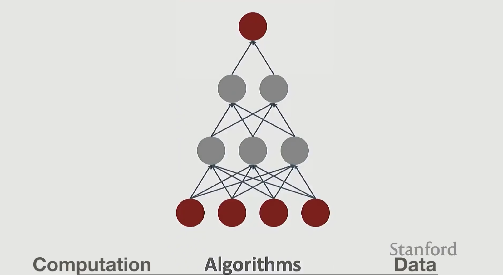

- 不是所有AI问题都是社会问题，人文问题和社会问题仍需解决

  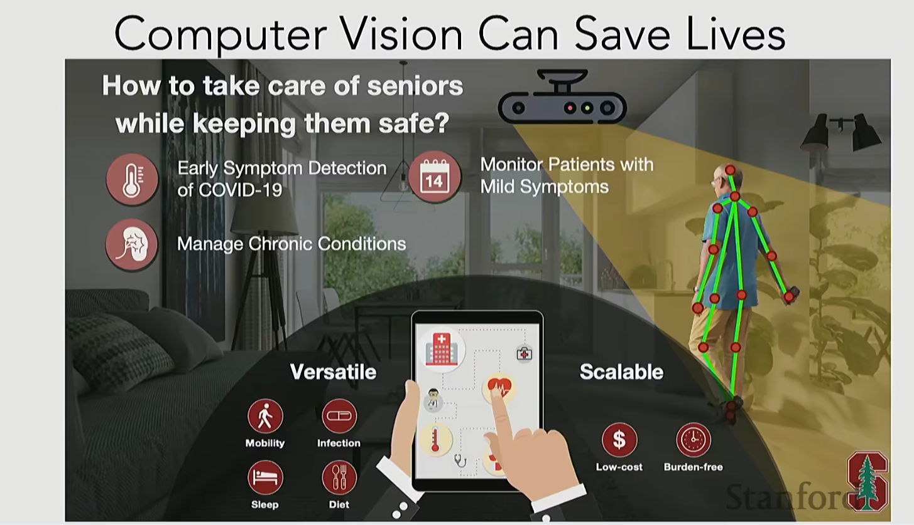

- **TASK（2D recognition）**
  - classification
  - semantic segmentation
  - object detection
  - instance segmentation
  - video classification
  - multimodal vidao understanding
  -  Visualization &  Understanding

- **Beyond 2D Recognition**
  - Self-supervised Learning
  - Generative Modeling
  - Vision Language Models
  - 3D Vision
  - Embodied Intelligence


# **Lecture 2: Image Classification with Linear Classifiers**

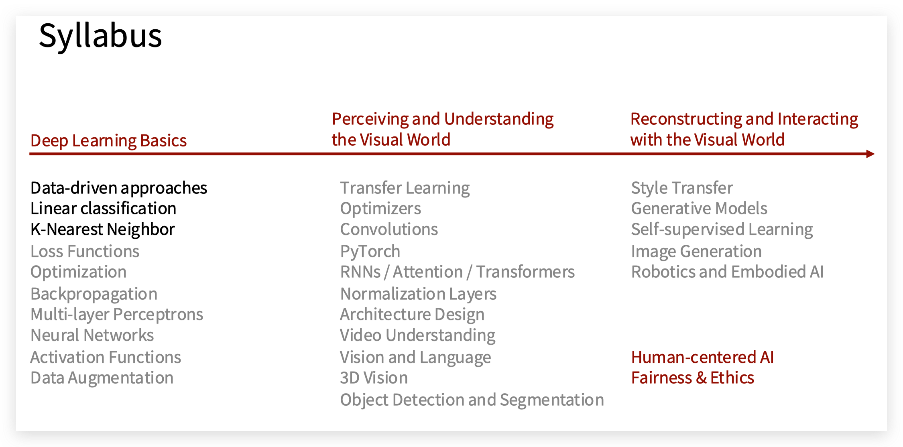

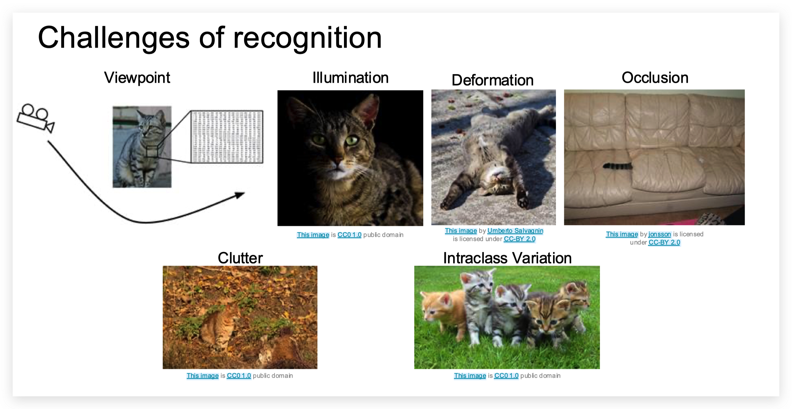

### K-nearest neighbor

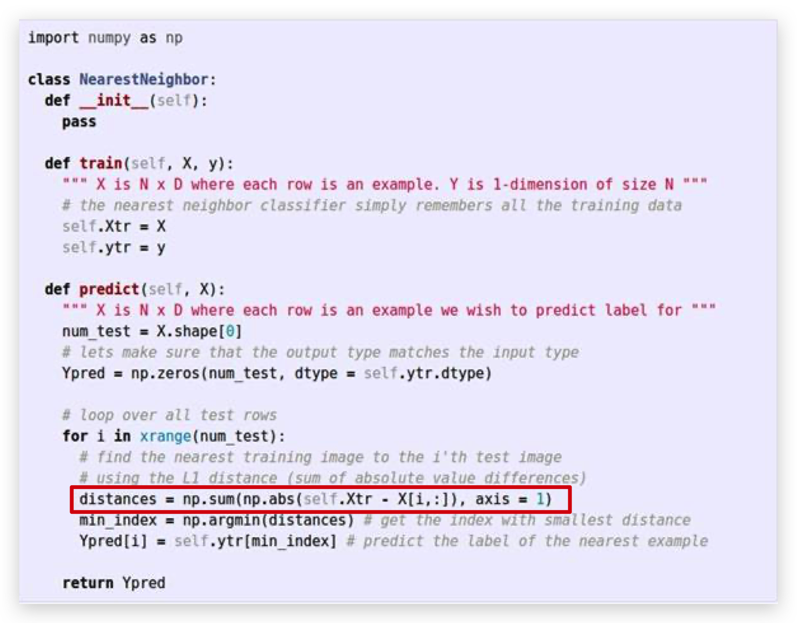

- 它没有用第二个 `for` 循环去遍历所有训练图片，而是利用了 **NumPy 的广播 (Broadcasting) 功能**。
- `self.Xtr - X[i,:]`：这一步直接将一个测试图片向量从整个训练集矩阵（`self.Xtr`）的**每一行**中减去。
- `np.abs(...)`：计算差值的绝对值。
- `np.sum(..., axis=1)`：沿着行（`axis=1`）的方向求和，最终得到一个向量 `distances`。该向量的第 `j` 个元素，就是第 `i` 个测试图片与第 `j` 个训练图片之间的 L1 距离。

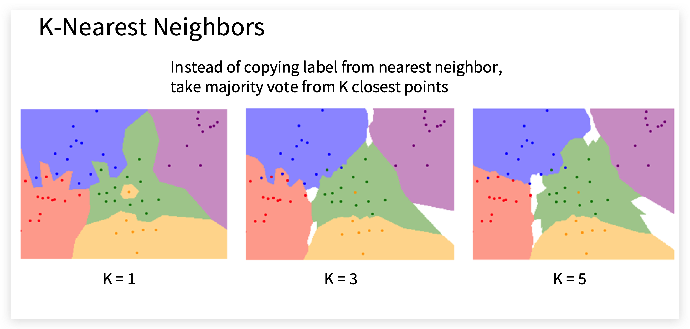

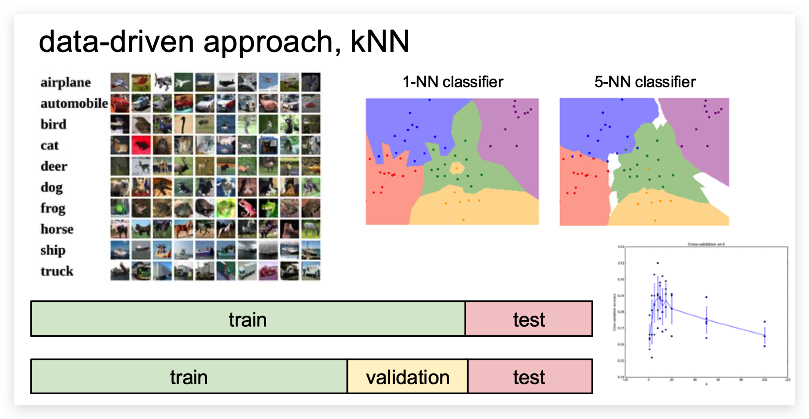

**`K` 太小**，模型容易受噪声影响，导致过拟合。

**`K` 太大**，模型可能忽略数据中局部的、细微的模式，导致决策边界过于模糊，产生**欠拟合 (Underfitting)**。


选择 L1 还是 L2 距离，是在选择用不同的“尺子”去衡量数据点间的远近。**L1 (曼哈顿) 距离**倾向于产生块状边界，而**L2 (欧几里得) 距离**倾向于产生更平滑的圆形边界.


#### Hyperparameters

**训练集 (Training Set):** 用于训练模型。

**验证集 (Validation Set):** 用于选择和调整超参数（比如比较K=1, 3, 5...哪个更好）。

**测试集 (Test Set):** 在所有工作完成后，用它对最终选定的模型进行一次评估，得到一个无偏的分数。


#### Conclusion

KNN 的思想非常直观：对于一张新的测试图片，它会在**训练集**中寻找与它**最相似（距离最近）的 K 个邻居**。然后，这 K 个邻居进行“投票”，**得票最多的那个类别**就是新图片的预测结果。

这就像你要判断一个陌生人的性格，就看看和他走得最近的几个朋友是什么样的人。

**关键设置：超参数 🔧**

要让 KNN 正常工作，需要我们手动设置两个关键的**超参数 (Hyperparameters)**：

1. **K 的值:** 邻居的数量。是找3个最近的邻居还是10个？
2. **距离度量 (Distance Metric):** 如何定义“相似性”。是用 L1（曼哈顿）距离还是 L2（欧几里得）距离？

**正确的实践方法 ✅**

为了找到最佳的超参数组合并公正地评估模型，必须遵循以下黄金法则：

- **使用验证集调参:** 你应该使用**验证集 (validation set)** 来试验不同的 `K` 值和距离度量，看哪种组合在验证集上表现最好。
- **测试集仅用一次:** **测试集 (test set)** 必须被严格保护起来，**只能在所有决策都完成后，用它进行一次最终的、客观的评估**。这就像期末考试，不能用来当练习册

---

### linear classifier

- **Different Viewpoint**

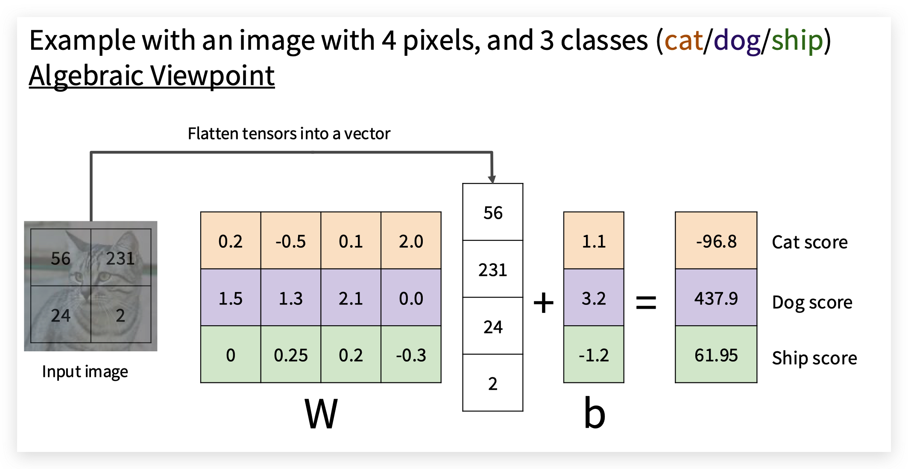

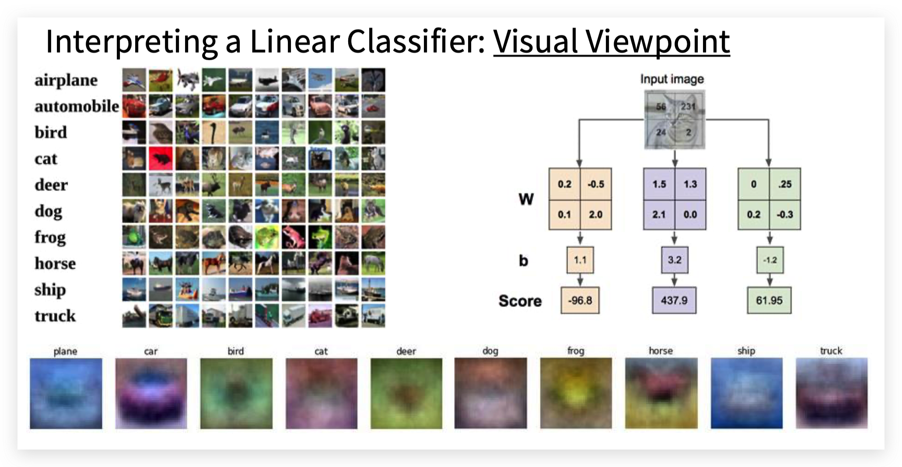

- 注意，例如，船的模板包含很多预期的蓝色像素。因此，当这个模板与海洋中船只的图像进行内积匹配时，将给出高分。
- 马模板似乎包含一个双头马，这是由于数据集中既有面向左边的马也有面向右边的马。线性分类器将这些马的数据模式合并为一个单一模板。同样，汽车分类器似乎将几个模式合并为一个单一模板，该模板必须识别来自各个方向和所有颜色的汽车
- **输入一张图片** (Input Image)，比如图中的猫。
- 模型将这张输入图片与**每一个类别**的**模板 (`W`)** 进行“匹配”。这个匹配过程在数学上是一个**点积 (dot product)(对应相乘)** 运算。如果输入图片的像素和某个模板的像素很吻合（比如，猫的像素和“猫”模板的像素），就会得到一个很高的正分。
- 在匹配得分的基础上，再加上一个**偏置项 `b` (bias)**。这个偏置项可以看作是一个“基础分”，让模型有更高的灵活性，不受图片本身影响地调整每个类的得分。
- 最终，每个类别都会得到一个**总分 (Score)**。

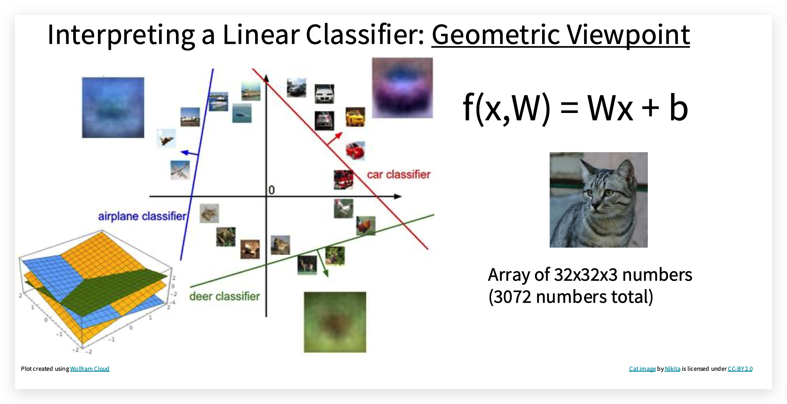

图像空间的表示，其中每个图像是一个单独的点，三个分类器被可视化。以汽车分类器（红色）为例，红色线条显示空间中所有对汽车类别得分为零的点。红色箭头表示增加的方向，因此红色线条右侧的所有点都有正分（且线性增加），左侧的所有点都有负分（且线性减少）

**计算小技巧**

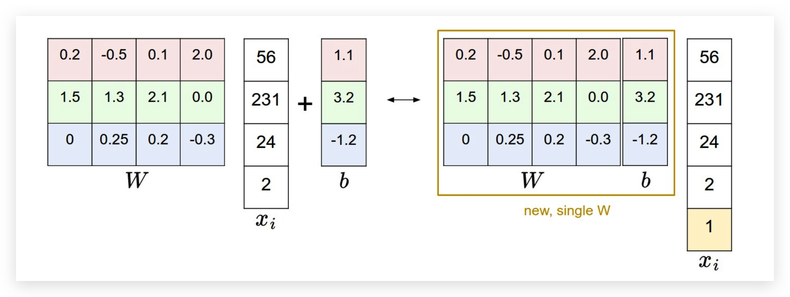

---

现在我们有了线性分类器的框架 (`Score = W·X + b`)，但又面临一个新问题：

> **如何衡量一个“模板” (`W`) 的好坏？** 或者说，我们应该如何定义**损失 (Loss)**，然后通过最小化这个损失来学习到最好的 `W`？

**SVM** 和 **Softmax** 就是对这个问题的两种不同回答。它们是两种不同的**损失函数**，代表了两种不同的“哲学”。

### Softmax classifier


$$
L_i = - \log \left( \frac{e^{f_{y_i}}}{\sum_j e^{f_j}} \right) \quad \text{or equivalently} \quad L_i = - f_{y_i} + \log \sum_j e^{f_j}
$$


**第一步：从分数到概率 🔢➡️📊**

- 线性分类器输出的**原始分数**转换成易于理解的**概率分布**。赋予其意义

**第二步：定义损失函数 📉**

- **目标:** 我们希望模型预测的**正确类别**的概率尽可能高（接近1）。

- **损失函数:** 为此，我们使用**交叉熵损失 (Cross-Entropy Loss)**，也叫**负对数似然损失 (Negative Log-Likelihood Loss)**。 

$$
L_i = -\log(P_{\text{正确类别}})
$$

- **工作原理:**
- 如果模型预测正确（正确类别的概率 P→1），那么 log(P)→0，损失值接近0，**惩罚很小**。
  
- 如果模型预测错误（正确类别的概率 P→0），那么 log(P)→−∞，损失值会变得非常大，**惩罚很大**。 这个函数完美地衡量了我们的目标。

**初始化时的损失 (Loss at Initialization) 🤔**

- **场景:** 在模型刚初始化时，它的权重是随机的，因此对所有 `C` 个类别的打分都差不多。
- **概率:** 在这种情况下，模型相当于在**随机猜测**。因此，任何一个类别的预测概率都约等于 **1/C**。
- **计算:** 将这个概率代入损失函数：$$Li≈−log(1/C)$$。根据对数函数的性质 $$-log(1/x)=log(x)$$，这等于 $$log(C)$$。

**实际用途:** 如果你的分类任务有10个类别（例如CIFAR-10），那么在训练开始时，你算出的损失值应该约等于$$log(10) ≈ 2.3$$。如果算出的初始损失与这个值偏差很大，你的代码很可能存在bug。

**交叉熵梯度推导**

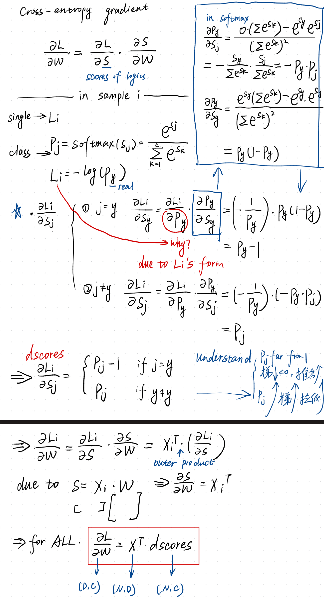

#### 理解

**Information theory view.**

**Probabilistic interpretation**.


### SVM（支持向量机）

SVM 损失函数对单个训练样本 i 的定义如下：
$$
L_i = \sum_{j \neq y_i} \max(0, s_j - s_{y_i} + 1)
$$
$j \neq y$：这个求和符号表示，我们需要遍历所有**不正确**的分类 $j$。

**用通俗的话来说，这个公式的意思是：**

对于一张图像，正确类别的分数 ($s_{y_i}$) 应该比所有错误类别的分数 ($s_j$) 至少高出一个 **间隔（margin）**（这里的 margin = 1）。

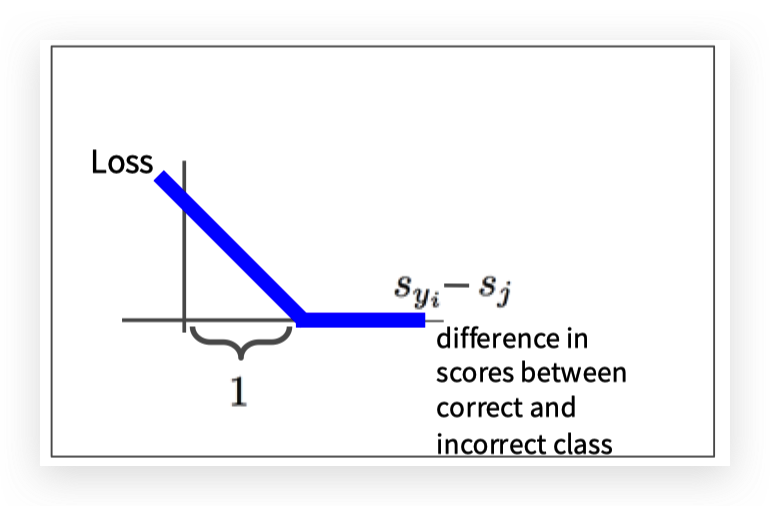

- 只要正确类别的分数领先错误类别至少 margin，**损失就是零**，模型不受惩罚。
- 一旦 margin 被破坏，损失就会 **线性增长**。错误类别分数越高，惩罚越大。

- 明显的“折线”形状正是它被称为 **Hinge Loss（铰链损失）** 的原因。

- 这张图生动地展示了 SVM 的核心哲学：它不追求无限完美，只要正确类别的得分能以一个**安全的边际**（这里是1）压倒所有其他类别，它就心满意足（损失为0）。只有当这个安全边际被侵犯时，它才会开始计算损失。相比而言，softmax更激进。


**目标**

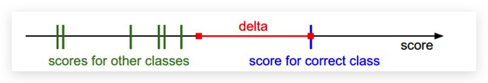SVM“希望”正确类别的分数至少比其他所有分数高出 delta 的差距。如果任何类别的分数在红色区域内（或更高)，则会有累积损失。否则损失将为零。我们的目标将是找到同时满足训练数据中所有示例的此约束并使总损失尽可能低的权重。

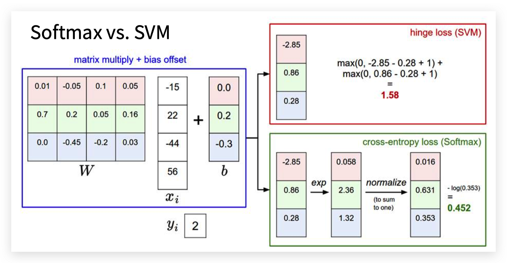


# Lecture 3: Regularization and Optimization

## Regularization 

> **防止机器学习模型过拟合 (Overfitting)** 并**提升其泛化能力 (Generalization)** 的技术总称

正则化。我们上面提出的损失(SVM)函数有一个问题。假设我们有一个数据集和一组参数 W，这组参数可以正确分类每个示例（即所有分数都满足所有间隔，并且对于所有 i， $$Li$$=0 ）。问题是这个 W 集不一定唯一：可能有多个类似的 W 可以正确分类示例。一个简单的方法是，==如果某些参数 W 可以正确分类所有示例（因此每个示例的损失为零），那么这些参数的任何倍数$$ λW$$ （其中 *λ*>1 ）也会给出零损失（**SVM**：关心的是**得分的差值**==。只要差值足够大（超过边界 `Δ`），损失就为零。继续放大权重只会让差值更大，损失依然为零。），因为这种变换均匀地拉伸了所有分数的大小，因此也拉伸了它们的绝对差异。例如，如果一个正确类别和最近的不正确类别之间的分数差异是 15，那么将 W 的所有元素乘以 2 会使新的差异变为 30
$$
{L=\underbrace{\frac{1}{N}\sum_iL_i}_{\mathrm{data~loss}}+\underbrace{\lambda R(W)}_{\text{regularization loss}}}
$$

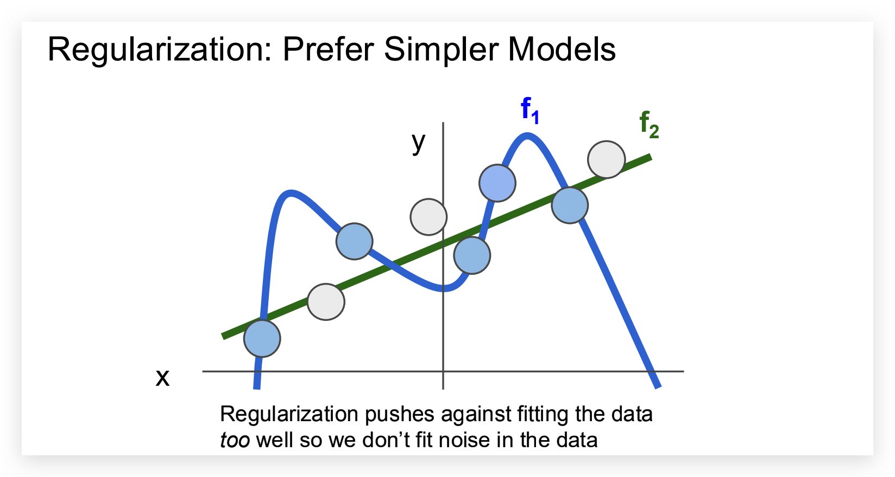

正则化是一种技术，旨在**防止模型在训练数据上表现得“过于完美”** 。它通过对模型的复杂度进行惩罚，鼓励模型学习更简单、更平滑的模式，从而提高泛化能力 。这背后有**奥卡姆剃刀原理**的支持：在多个同样有效的假设中，选择最简单的那一个 。


**正则化方法**

- **L2：让模型重分布更均匀、更分散**
- **L1：让模型权重变稀疏（很多权重变为0），从而达到特征选择的效果**
- **BatchNormalization**
- **Dropout**


## Stochastic Gradient Descent

**SGD的问题**

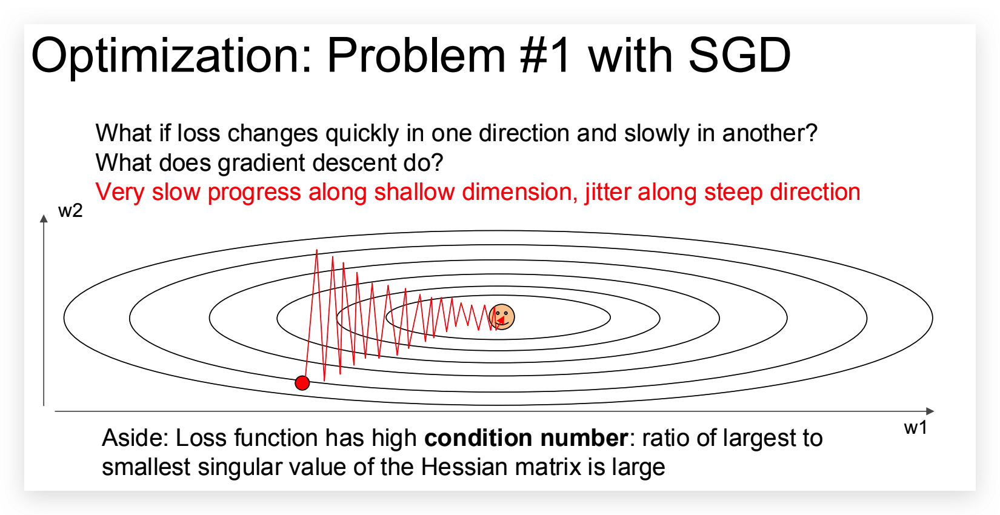

**缺点**:

1. **收敛路径曲折**: 这种问题在数学上被称为**高条件数（high condition number）**。这意味着损失函数在不同方向上的曲率差异巨大。条件数越大，这种“拉长”的现象就越严重，SGD 的表现就越差。
2. **可能陷入局部最小值或鞍点**: 在这些点梯度为零，SGD会卡住不动 。在神经网络这种高维空间中，鞍点比局部最小值更常见 。
3. **梯度噪声**: 由于使用小批量数据，梯度估计存在噪声 。

**➡️解决方法：**

## Momentum, AdaGrad, Adam

**SGD + Momentum (动量)**:

- 引入一个“速度”变量 v，它是过去梯度的**移动指数平均**（赋予近期数据更大的权重，而随着数据时间推移，其权重呈指数级衰减） 。更新时不仅考虑当前梯度，还考虑之前的“惯性” 。
- **效果**: 可以帮助冲过局部最小值或鞍点，并减少在陡峭方向上的震荡，加速在平缓方向上的收敛 。

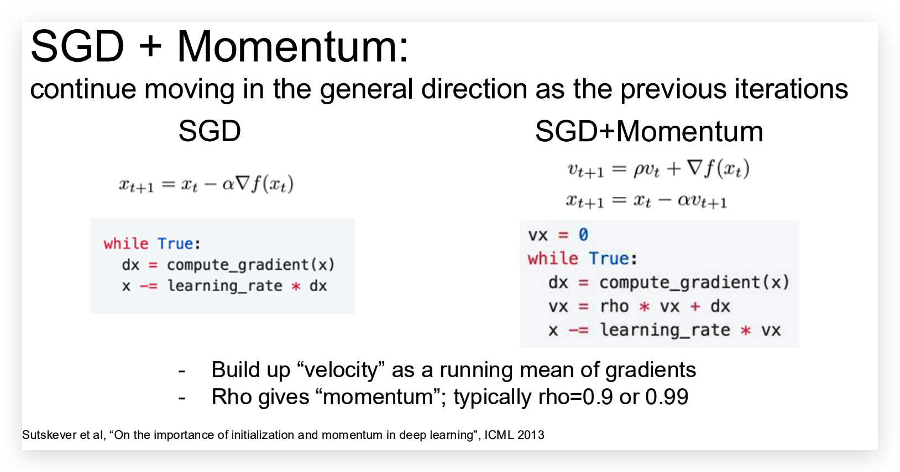

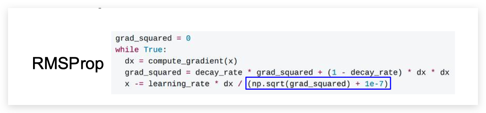

**RMSProp**:

- 引入了自适应学习率 。它会记录每个参数过去梯度的平方的加权平均值 。

- **效果**: 对于梯度较大的参数，它会用一个较大的数去除，从而减小更新步长；对于梯度较小的参数则相反 。这样可以在不同方向上使用不同的学习率，加速收敛。

**➡️Momentum是方向上的，而RMSProp是大小上的**

> **Momentum (动量) 关注的是“方向上的一致性”**
>
> - 它通过累积历史梯度，判断参数更新的方向是否“心无旁骛”。如果方向一直很稳定，它就会“加速”；如果方向来回摇摆，它就会“减速”并抑制摆动。它像一个有惯性的物理小球。
>
> **RMSProp 关注的是“历史上梯度的大小”**
>
> - 它不关心方向，只关心每个参数的梯度值的大小，也就是这个参数的“活跃程度”。如果一个参数的梯度长期都很大（很活跃），它就降低这个参数的学习率让它“冷静”下来；如果一个参数的梯度长期都很小（不活跃），它就提高这个参数的学习率“鼓励”它多更新一点。

| 特性       | SGD + Momentum                             | RMSProp                                                      |
| ---------- | ------------------------------------------ | ------------------------------------------------------------ |
| 核心思想   | 累积历史梯度，产生“惯性”或“动量”。         | 累积历史梯度的平方，实现自适应调整。                         |
| 学习率     | 所有参数共享一个全局学习率 learning_rate。 | 为每个参数计算一个有效的、不同的学习率。                     |
| 更新机制   | $x←x−learning_rate⋅vx$                     | $\mathrm{x\leftarrow x-\eta\cdot\frac{\partial L}{\partial x}/\sqrt{\mathbb{E}[g_t^2]}}$【**$E[gt2]$ 整个符号的含义是：** 它是一个累积的、加权平均的**历史梯度平方**。】 |
| 解决的问题 | 主要解决SGD的震荡和收敛慢问题。            | 在**陡峭**的方向（峡谷两侧），我们希望更新步伐**小一点**，防止来回震荡。在**平缓**的方向（峡谷底部），我们希望更新步伐**大一点**，以加快前进速度。 |

**Adam (Adaptive Moment Estimation)**:

- 可以看作是**动量和RMSProp的结合** 。它同时记录了梯度的一阶矩（动量）和二阶矩（类似RMSProp）的估计 
- **优点**: 通常效果很好，是目前最常用的优化器之一。对于很多模型，使用默认参数（`beta1=0.9`, `beta2=0.999`, `learning_rate=1e-3`）就能取得不错的效果 。

**AdamW**:

- 这是Adam的一个变种，它改进了L2正则化（权重衰减）的实现方式，使其在Adam中更有效 。

  

**Conclusion**

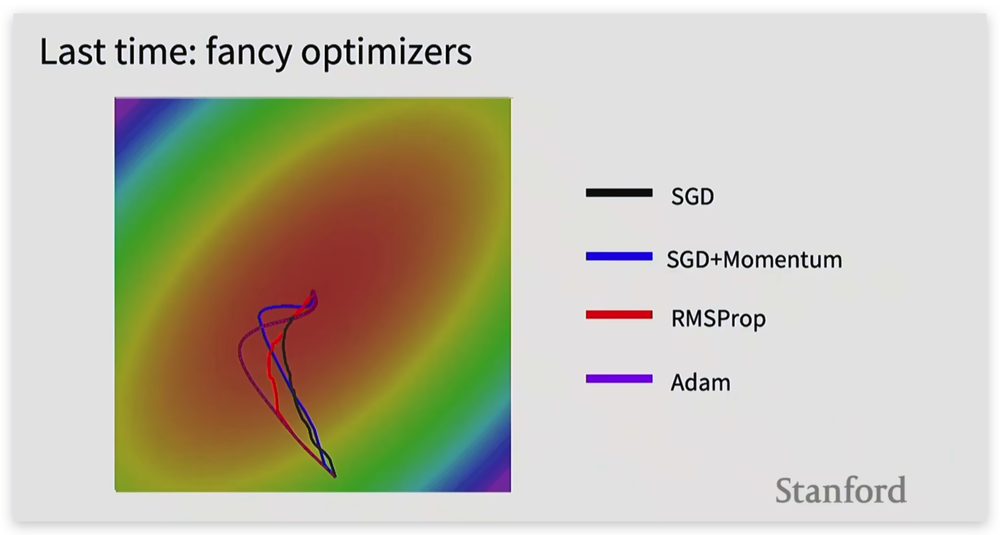

#### ⚫ **SGD (Stochastic Gradient Descent)** - 黑色线条

- **特点**: 路径非常**曲折和震荡**。
- **原因**: SGD 完全依赖于当前批次的梯度来决定下降方向。在这个狭长的“峡谷”地形中，梯度方向几乎总是垂直于等高线，指向对面最陡峭的“坡壁”。因此，SGD 会在峡谷的两壁之间来回震荡，而在通往谷底的平缓方向上进展缓慢。
- **总结**: 简单但“盲目”，容易在陡峭方向上震荡，收敛缓慢。

#### 🔵 **SGD+Momentum (带动量的SGD)** - 蓝色线条

- **特点**: 相比 SGD，震荡被明显**抑制**，路径更加**平滑**。
- **原因**: Momentum（动量）引入了一个“速度”变量，它累积了过去梯度。这就像一个从山上滚下来的球，它带有惯性。这个惯性可以：
  1. **减弱震荡**: 在陡峭方向上来回的梯度会相互抵消，使得速度在该方向上的分量减小。
  2. **加速前进**: 在平缓方向上，梯度方向基本一致，历史梯度会不断累积，从而加速前进。
- **总结**: 聪明一点，利用“惯性”抑制震荡，加速收敛。

#### 🔴 **RMSProp** - 红色线条

- **特点**: 路径更加**直接**，震荡幅度非常小。
- **原因**: RMSProp 是一种**自适应学习率**算法。它会跟踪每个参数梯度的历史平均大小。
  - 对于梯度一直很大的陡峭方向，它会用一个较大的数来除以学习率，从而**减小**在该方向上的步长。
  - 对于梯度一直很小的平缓方向，它会用一个较小的数来除以学习率，从而**增大**在该方向上的步长。
- **总结**: 非常智能，能“因地制宜”地调整不同方向上的学习步伐，走得更稳更快。

#### 🟣 **Adam** - 紫色线条

- **特点**: 路径通常被认为是**最高效、最稳定**的之一（虽然在这张特定的图里和 RMSProp 类似）。
- **原因**: Adam 算法可以看作是 **Momentum 和 RMSProp 的结合体**。它既利用了动量来加速前进，又利用了自适应学习率来调整每个参数的步长。
- **总结**: 集大成者，结合了动量和自适应学习率的优点，通常是各种任务中的首选优化器，因为它收敛快且表现稳定。


## Learning rate schedules

  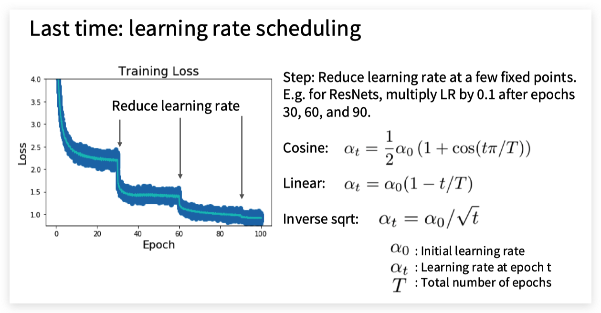


# Lecture 4: Neural Networks and Backpropagation

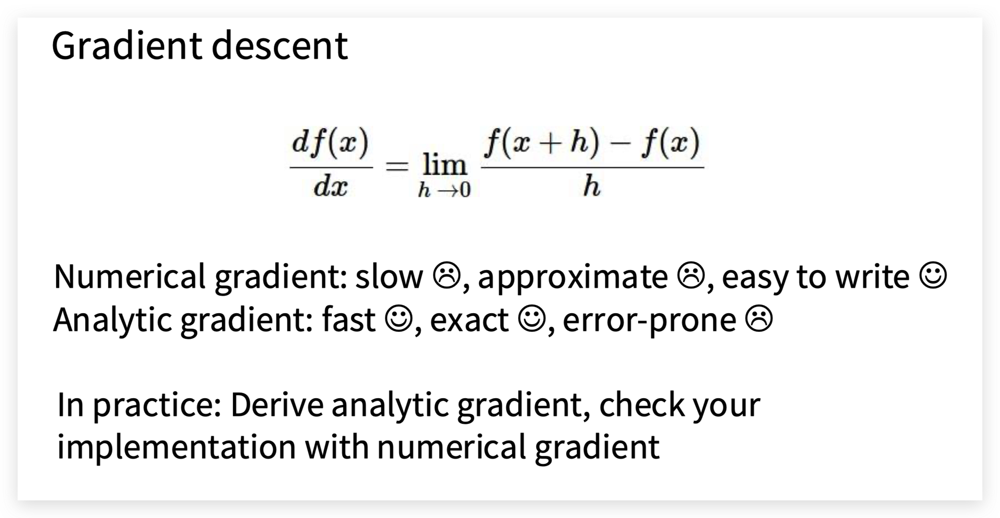


$$
\frac{df(x)}{dx}=\lim_{h\to0}\frac{f(x+h)-f(x)}{h}
$$
**数值梯度 (Numerical Gradient)**

这种方法直接利用上面那个导数定义公式来近似计算梯度。我们会取一个非常小的 h（比如 1e−5），然后计算出梯度的近似值。

- **优点: 容易编写 (easy to write 😊)**
  - 它的实现非常简单直观，因为你不需要进行复杂的微积分推导。你只需要一个能计算函数值的函数 f 即可。
- **缺点: 慢 (slow 😟) 且是近似值 (approximate 😟)**
  - **近似**：因为 h 不能无限趋近于0，所以计算结果永远只是一个近似值，不是精确值。
  - **慢**：在神经网络中，参数可能有数百万个。要计算完整的梯度，你需要对**每一个参数**都单独进行一次 `f(x+h)` 的计算，这使得计算量变得非常巨大，训练会极其缓慢。

**分析梯度 (Analytic Gradient)**

这种方法使用微积分（求导法则）来推导出梯度的**精确数学表达式**。例如，如果 f(x)=x2，那么它的分析梯度就是 f′(x)=2x。在神经网络中，我们用来计算分析梯度的算法就是**反向传播（Backpropagation）**。

- **优点: 速度快 (fast 😊) 且精确 (exact 😊)**
  - **精确**：它给出的是梯度的真实值，没有任何近似误差。
  - **快**：通过反向传播，我们可以用一次前向和一次反向计算就得出所有参数的梯度，这比数值梯度逐个计算参数的方式快成千上万倍。
- **缺点: 容易出错 (error-prone 😟)**
  - 手动推导复杂函数的梯度公式很容易出错。将推导出的公式转换成代码也可能引入 bug。

**实践中的最佳策略 (In Practice)**

图片最后一行给出了在实际工程中的黄金法则：

> **推导出分析梯度，然后用数值梯度来检查你的实现。**

这就是所谓的**梯度检查（Gradient Check）**。

- **步骤**：
  1. 首先，实现你认为正确的**分析梯度**（反向传播）。
  2. 然后，实现一个简单的**数值梯度**作为“标尺”或“标准答案”。
  3. 在一个小数据集上，同时用这两种方法计算梯度，并比较它们的结果。
  4. 如果两个结果非常接近（误差极小），你就可以很有信心地认为你的分析梯度代码是正确的。
- **目的**：
  - 在确认分析梯度实现无误后，你就可以在整个训练过程中放心地使用快速且精确的分析梯度，而把又慢又占资源的数值梯度关掉。


## Multi-layer Perceptron

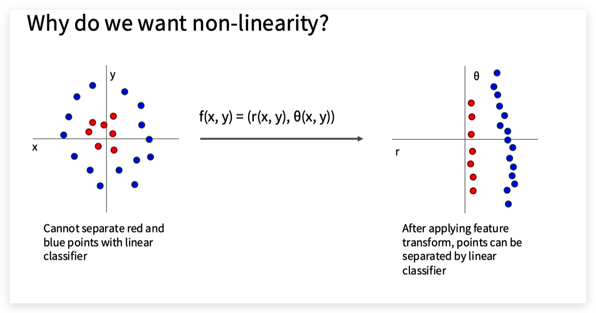

**从这里到神经网络**

这个例子启发我们，非线性变换非常强大。但问题是，我们如何为复杂的数据找到一个像“极坐标变换”这样恰到好处的变换函数呢？

**这正是神经网络的核心价值所在。**

神经网络，尤其是深度神经网络，通过其**隐藏层和非线性激活函数（如 ReLU）**，能够**自动地、从数据中学习**这些复杂的非线性变换。我们不再需要手动设计特征变换，网络会自己学习如何逐层地将原始的、线性不可分的数据，变换到一个高维的、让最终分类变得简单的特征空间。


 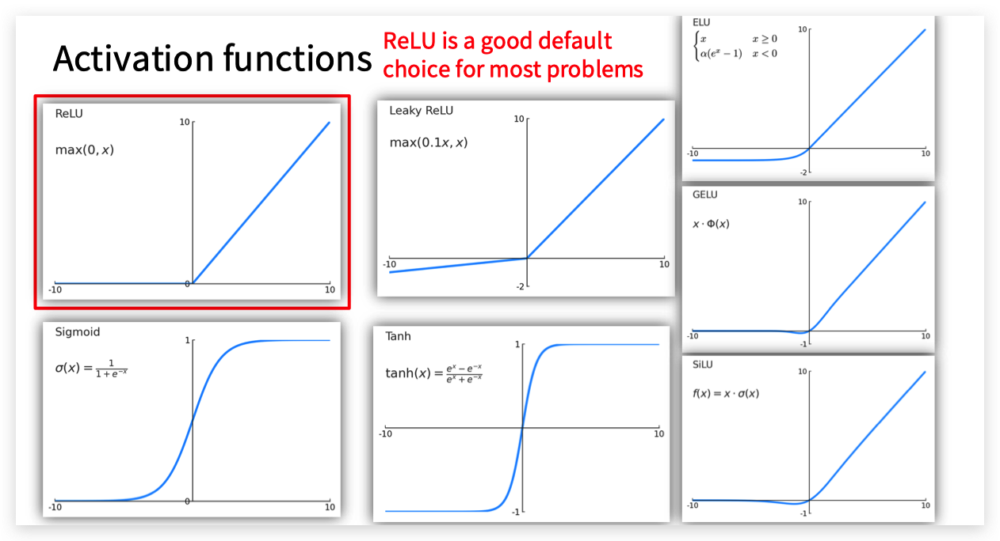

- **ReLU (Rectified Linear Unit) - 修正线性单元**
  - **缺点**：**Dying ReLU (ReLU神经元死亡)**: 如果一个神经元的输入恒为负数，那么它的输出将永远是0，其梯度也永远是0。这意味着该神经元的参数将永远不会被更新，它在网络中就“死亡”了。
-  **Leaky ReLU - 带泄露的ReLU**
  - 解决了Dying ReLU 问题，使得所有神经元都能保持“活性”。但是其性能不一定总是优于标准 ReLU。
- **Sigmoid（常用于最后层）**
  - **缺点：梯度消失: 当输入非常大或非常小时，函数的曲线变得非常平坦，导致梯度趋近于0。这会严重阻碍深度网络的训练。**
- **Tanh (Hyperbolic Tangent) - 双曲正切（常用于最后层）**
  - **缺点**：与 Sigmoid 类似，它同样存在**梯度消失**的问题
- **ELU (Exponential Linear Unit) - 指数线性单元**
- **GELU (Gaussian Error Linear Unit) - 高斯误差线性单元**
- **SiLU (Sigmoid Linear Unit)**

**经验性的选择，像超参数一样**

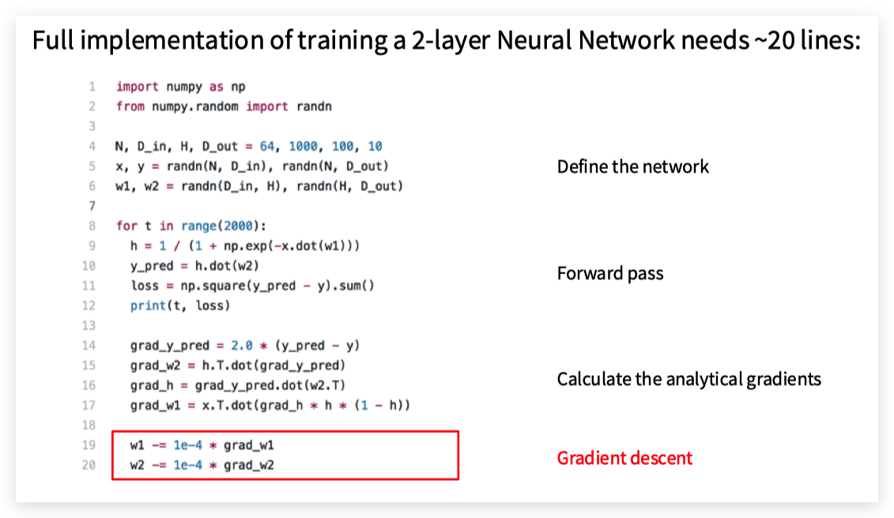

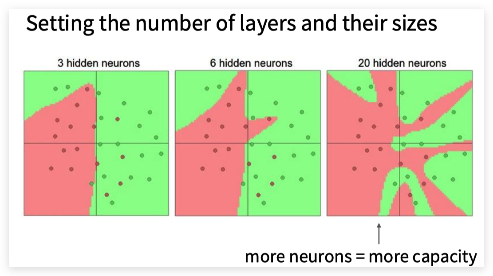


## Backpropagation

**（Bad） Idea: Derive $\nabla_WL$ on paper**

- ​	Problem: Very tedious: Lots of matrix calculus, need lots of pape


**Better Idea: Computational graphs + Backpropagation**

> **模块化反向传播的计算**

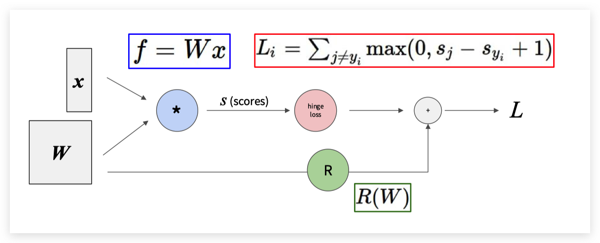

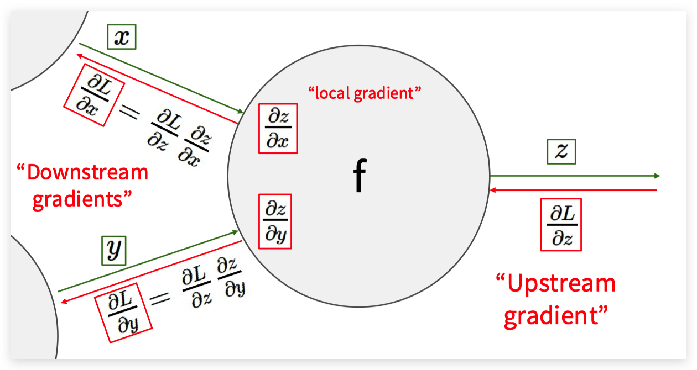

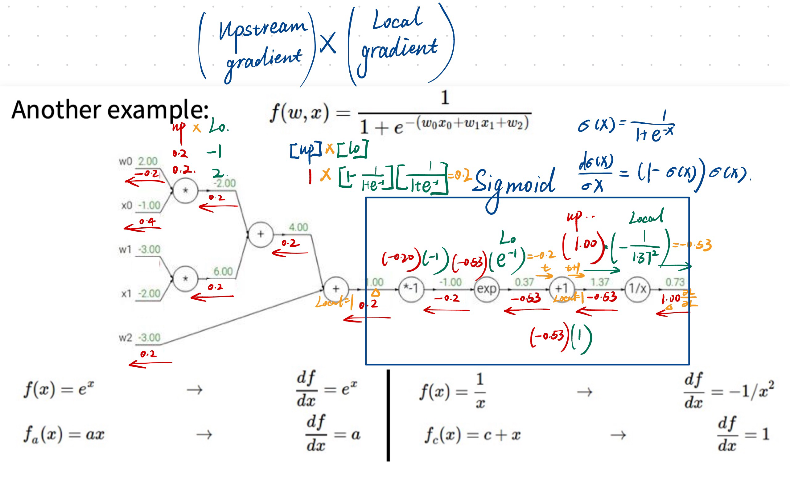

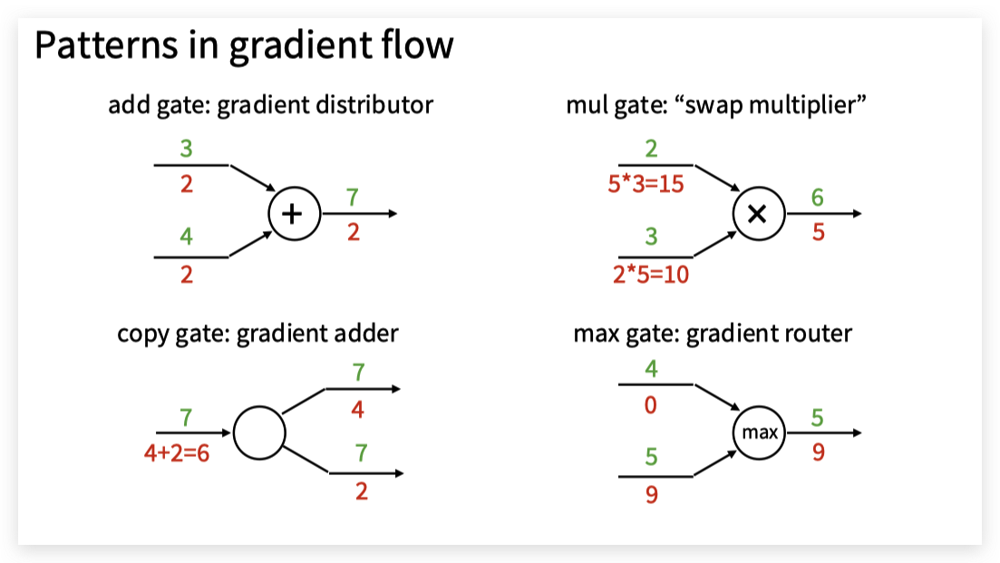

- **Copy gate 理解**
  $$
  L=f(g(x),h(x))
  $$

  $$
  \frac{\partial L}{\partial x}=\frac{\partial L}{\partial g}\frac{\partial g}{\partial x}+\frac{\partial L}{\partial h}\frac{\partial h}{\partial x}
  $$

  $$
  \frac{\partial g}{\partial x}=1\quad\mathrm{and}\quad\frac{\partial h}{\partial x}=1
  $$

  $$
  \frac{\partial L}{\partial x}=\frac{\partial L}{\partial g}(1)+\frac{\partial L}{\partial h}(1)=\frac{\partial L}{\partial g}+\frac{\partial L}{\partial h}
  $$

  

  

**如何反向传播**

- **Flat code**

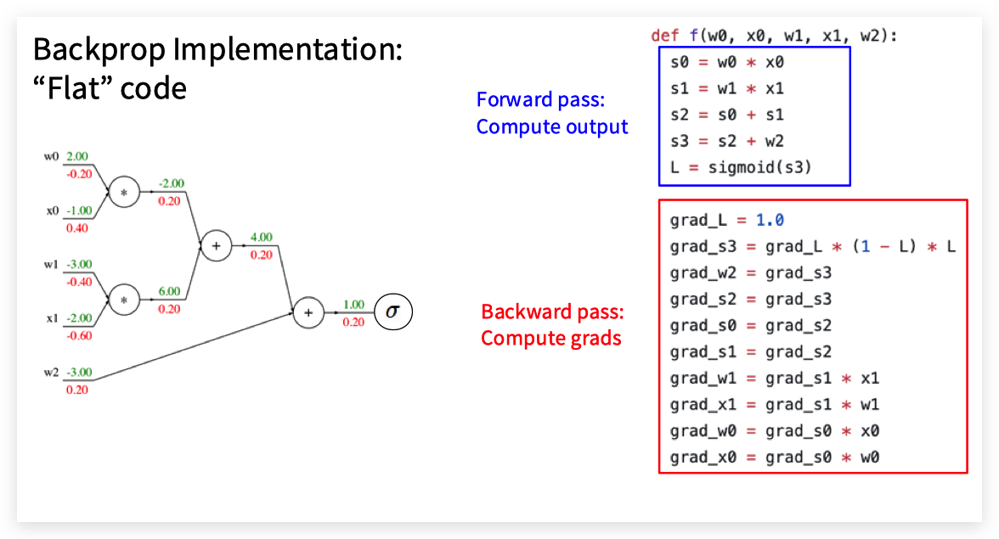

- **Modularized implementation: forward / backward API**

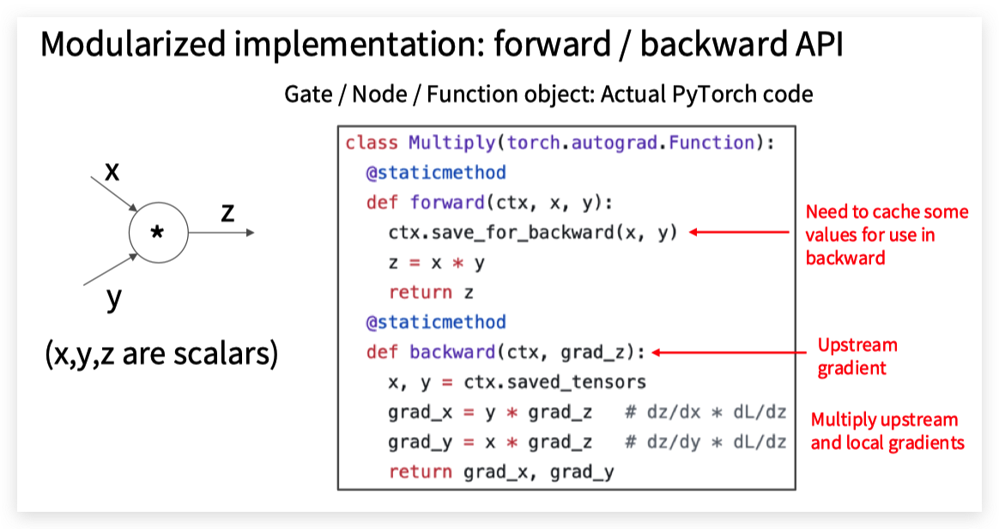 

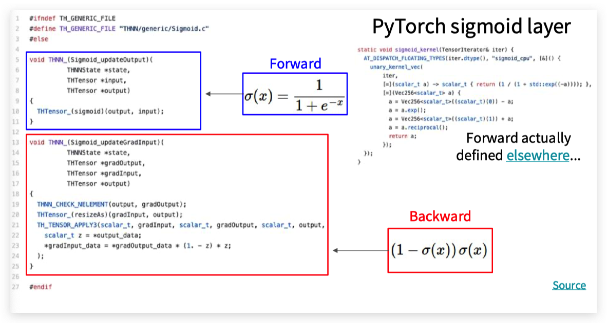

https://github.com/pytorch/pytorch

**➡️So far: backprop with scalars. What about vector-valued functions?**

 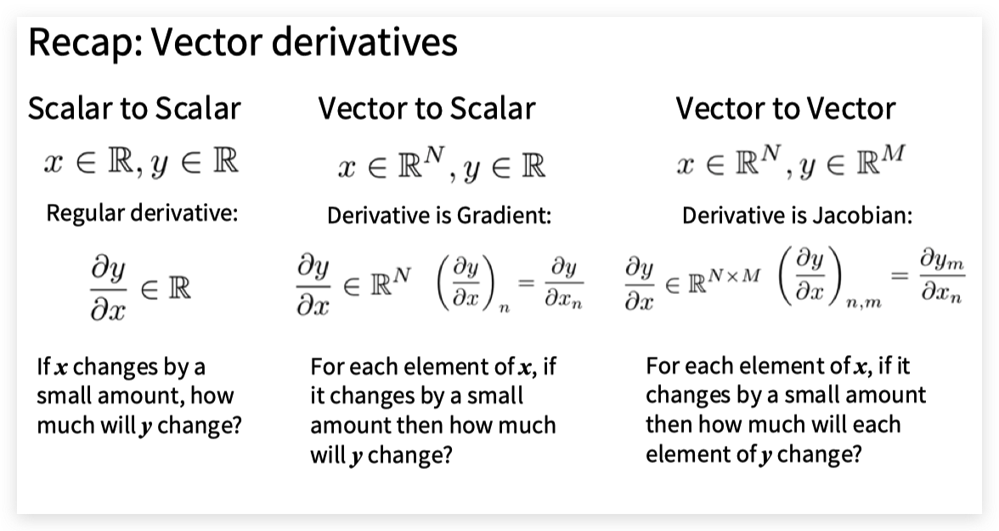

1. **标量对标量求导 (Scalar to Scalar)**

- **直观理解**: “如果 x 发生微小的变化， y 会相应地变化多少？”。这描述的是函数在某一点上的斜率或变化率。

2. **向量对标量求导 (Vector to Scalar)**

- **类型**: 这种导数被称为**梯度 (Gradient)**。
- **结果**: 结果 $∂x∂y$ 是一个和输入 x 维度相同的**向量**。这个向量的第 n 个元素是输出 y 对输入向量 x 的第 n 个分量 xn 的偏导数，即$ (∂x∂y)n=∂xn∂y$。
- **直观理解**: “对于 x 中的**每一个**元素，如果它发生微小的变化，那么 y 会变化多少？”。
- **应用**: 这是机器学习中最常见的情况。例如，**损失函数**（一个标量）对模型的**所有参数**（一个向量）求梯度。梯度向量指向损失函数上升最快的方向。

3. **向量对向量求导 (Vector to Vector)**

- **定义**: 输入 x 是一个向量，输出 y 也是一个向量。
  - $x\in\mathbb{R}^N,y\in\mathbb{R}^M$
- **类型**: 这种导数被称为**雅可比矩阵 (Jacobian)**。
- **结果**: 结果 ∂x/∂y 是一个 M×N 的**矩阵。矩阵中位于第 m 行、第 n 列的元素是输出向量 y 的第 m 个分量 ym 对输入向量 x 的第 n 个分量 xn 的偏导数 (幻灯片中的写法是 $\frac{\partial y}{\partial x}\in\mathbb{R}^{N\times M}\left(\frac{\partial y}{\partial x}\right)_{n,m}=\frac{\partial y_{m}}{\partial x_{n}}$，这表示矩阵的 `(n,m)` 位置的元素是 ym 对 xn 的偏导)。
- **直观理解**: “对于 x 中的**每一个**元素，如果它发生微小的变化，那么 y 中的**每一个**元素会相应地变化多少？”。
- **应用**: 雅可比矩阵描述了输入向量的每个元素如何影响输出向量的每个元素，它包含了所有可能的偏导数信息。在神经网络中，每一层都可以看作是一个向量到向量的函数，因此层与层之间的梯度传递就会涉及到雅可比矩阵。

**P.S. Jacob**

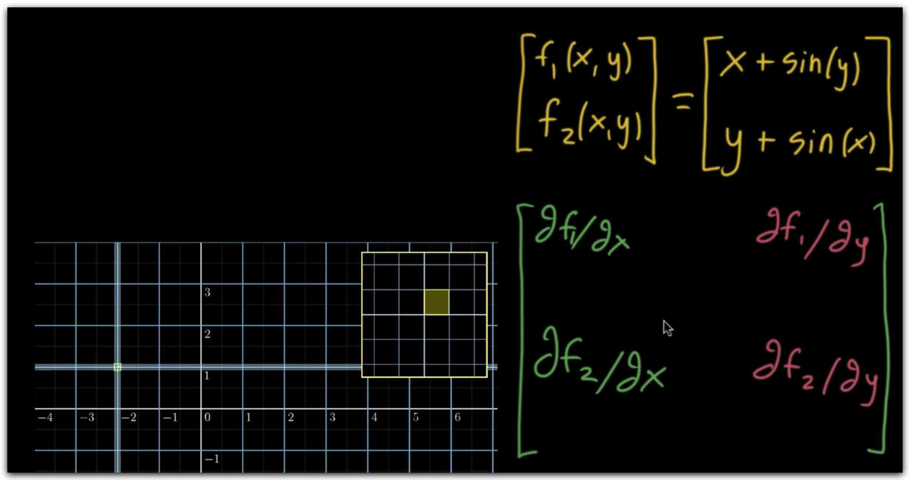

>   **雅可比矩阵，可以用于来分析我们的微小空间在变换中伸缩了多少**

 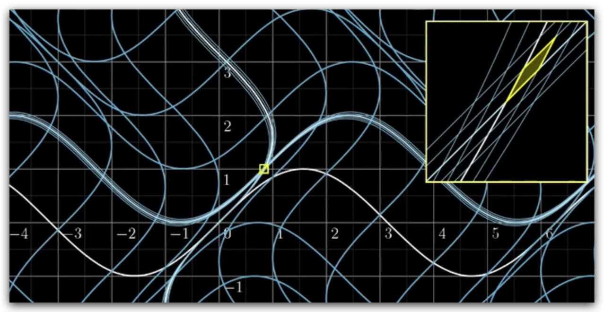

➡️**雅可比矩阵 (Jacobian) 本身并不是一个梯度，而是代表了局部导数的矩阵。在反向传播中，我们用这个雅可比矩阵（的转置）去左乘（left-multiply）上游梯度向量，从而得到下游梯度向量。**

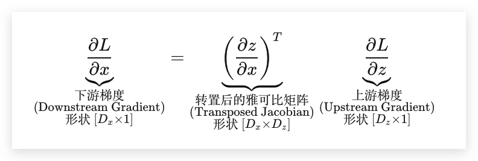

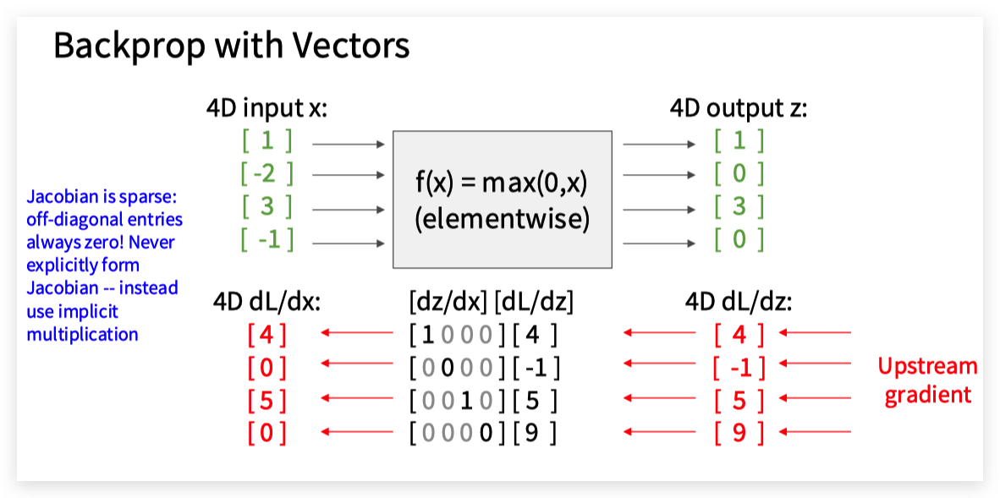

在神经网络中，很多操作的雅可比矩阵（Jacobian）绝大部分元素都是0（即**稀疏**的），如果专门在内存里构建这个巨大的、空荡荡的矩阵，会极度浪费**内存**和**计算资源**。所以我们不那么做，而是通过“隐式乘法”直接算出最终结果。

这源于神经网络中大量存在的**逐元素操作 (element-wise operations)**【一一对应】，比如激活函数（ReLU, Sigmoid等）。

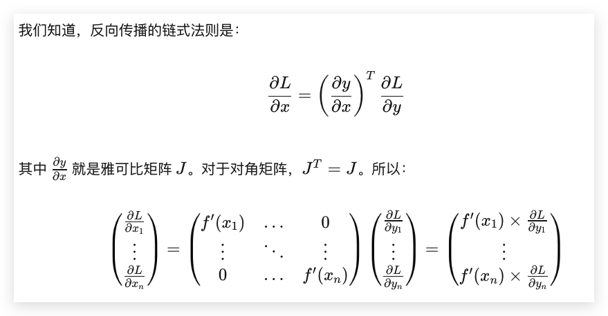

**➡️Matrix：**

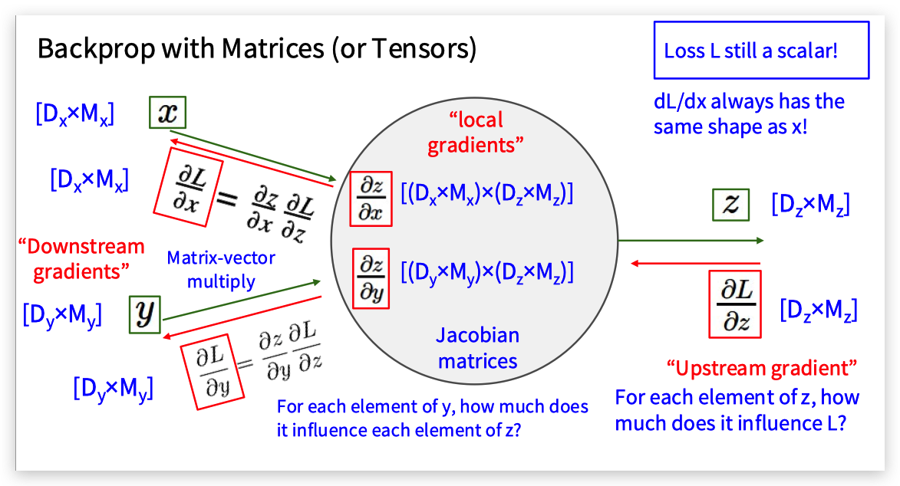  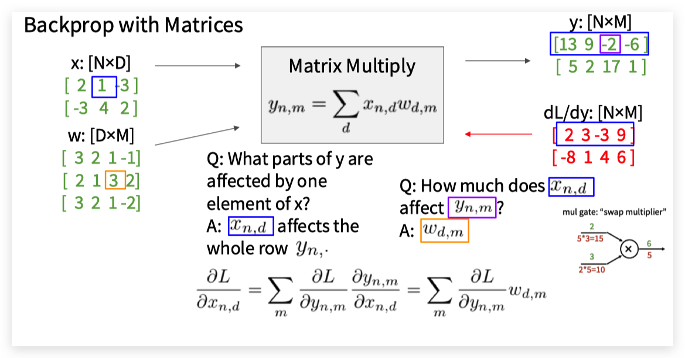

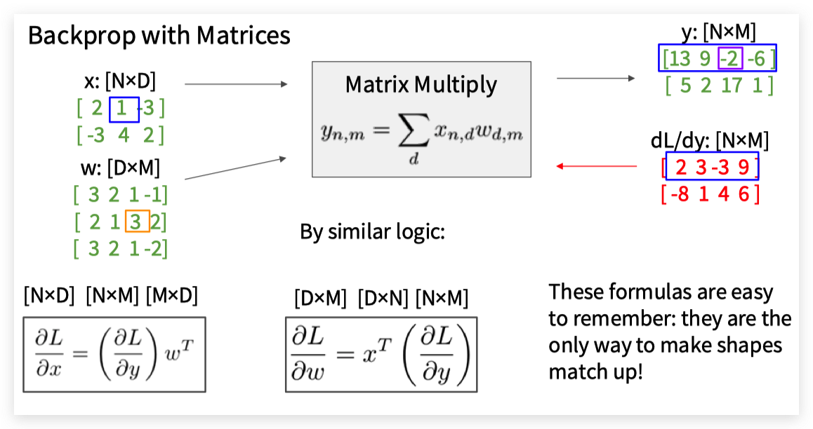

**推导 `dL/dx` (对输入 x 的梯度)**

- **背景设定**

  - **前向传播**: 我们有一个矩阵乘法运算。
    $$
    y = x * w
    $$

  - **维度**:

    - 输入 `x` 的维度是 `[N x D]` (N个样本, 每个样本D维)。
    - 权重 `w` 的维度是 `[D x M]` (将D维输入映射到M维输出)。
    - 输出 `y` 的维度是 `[N x M]`。

  - **已知**: 我们已经通过后续的计算得到了“上游梯度” `dL/dy`，它的维度和 `y` 相同，为 `[N x M]`。

  - **目标**: 我们需要计算“下游梯度”，即损失 `L` 对输入 `x` 和权重 `w` 的梯度：`dL/dx` 和 `dL/dw`。

- **提出问题**: 矩阵 `x` 中的某一个元素 `x_n,d`（第n行, 第d列的元素）会影响输出 `y` 中的哪些部分？

- **关键洞察**: 根据矩阵乘法定义的定义，`x_n,d` 会参与到输出 `y` **第n行的所有元素** (`y_n,1`, `y_n,2`, ..., `y_n,M`) 的计算中。

- **应用链式法则**:

  - 为了计算 `L` 对 `x_n,d` 的总梯度，我们需要将 `x_n,d` 通过 `y` 的第n行所有元素对 `L` 产生的影响全部加起来。数学上，这就是多变量链式法则：
    $$
    \frac{\partial L}{\partial x_{n,d}} = \sum_{m=1}^{M} \frac{\partial L}{\partial y_{n,m}} \frac{\partial y_{n,m}}{\partial x_{n,d}}
    $$
  
- 其中，$\frac{\partial y_{n,m}}{\partial x_{n,d}}$ 是局部梯度。因为 $y_{n,m} = x_{n,1}w_{1,m} + ... + x_{n,d}w_{d,m} + ...$，所以它对 $x_{n,d}$ 的偏导数就是 $w_{d,m}$。

**得到矩阵形式**:

- 将局部梯度代入，我们得到：
  $$
  \frac{\partial L}{\partial x_{n,d}} = \sum_{m=1}^{M} \frac{\partial L}{\partial y_{n,m}} w_{d,m}
  $$
  

  这个求和运算其实就是 `dL/dy` 的第n行和 `w` 的第d列的点积，也就是 `dL/dy` 的第n行和 `w` 转置后 (`w^T`) 的第d列的点积。

- 将这个逻辑推广到整个矩阵，我们就得到了最终的梯度公式：
  $$
  \frac{\partial L}{\partial x} = \frac{\partial L}{\partial y} \cdot w^T
  $$
  
- **维度检查**: 维度完全匹配！
  $$
  [N x D] = [N x M] @ [M x D]
  $$
  

**推导 `dL/dw` (对权重 w 的梯度)**

同理,
$$
\frac{\partial L}{\partial w} = x^T \cdot \frac{\partial L}{\partial y}
$$


# **Lecture 6: CNN Architectures**

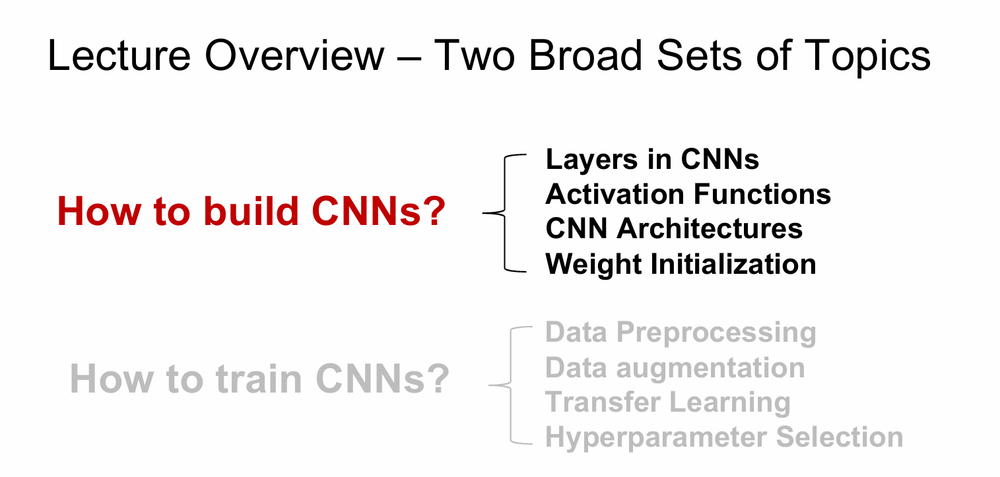

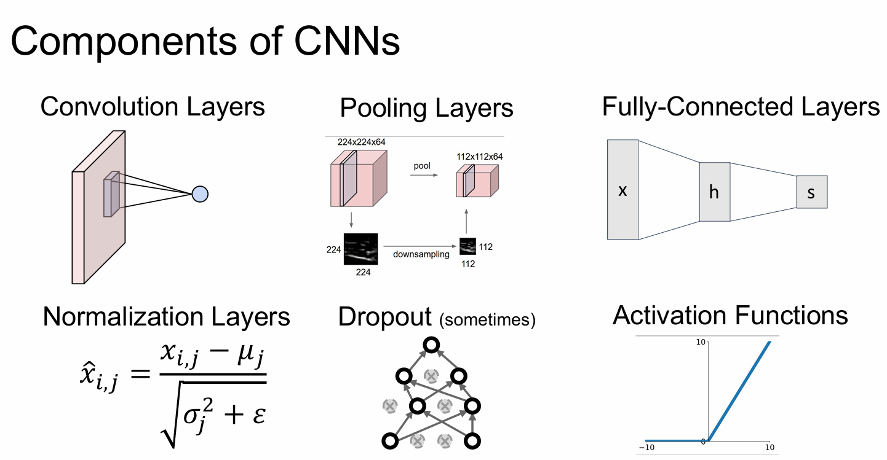

- ### **Pooling Layers**——下采样——增加感受野

- ### **LayerNorm**——学习模型的最佳分布  

  - 核心思想是在**单个训练样本**内部，对其所有特征进行归一化，从而使训练过程对数据的具体尺度不那么敏感

    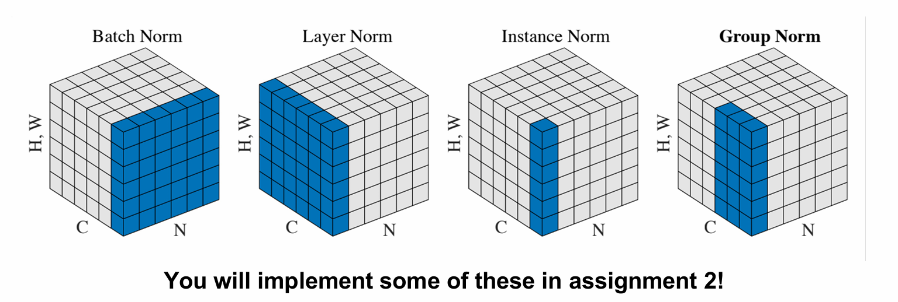

    - **N (Batch):** 批次大小，代表一次处理多少个数据样本（比如，一次处理多少张图片）。

      **C (Channel):** 通道数。对于RGB图像，C=3。在卷积网络深层，C可以代表特征图的数量，比如64, 128。

      **H, W (Height, Width):** 特征图的高度和宽度，即空间维度。

    - #### 1. 批量归一化 (Batch Norm)

      - **在 batch 维度上归一化**
      - **通俗理解：** 把一批（N）图片中，同一个通道（比如“红色”通道）的所有像素值都拿出来，一起计算平均值和方差，然后用这个标准来归一化这个通道。
      - **适用场景：** 在卷积神经网络（CNN）中非常常用且效果很好，但对批次大小（Batch Size）比较敏感。
      
      #### 2. 层归一化 (==Layer Norm==)
      
      - **LayerNorm 是在特征维度上归一化————同一起跑线，再自定每个特征的重要性**
      
      - ###### **通俗理解：** 只看批次中的某一张图片，把它的所有通道（红、绿、蓝等）的所有像素值都拿出来，一起计算平均值和方差，然后用这个标准来归一化这张图片自己。它完全不关心批次中的其他图片。
      
      - **适用场景：** 在Transformer和循环神经网络（RNN）中是标配，因为它不受批次大小影响，非常适合处理序列数据。
      

- ### **Dropout**

   **In each forward pass, randomly set some neurons to zero Probability of dropping is a hyperparameter; 0.5 is common**

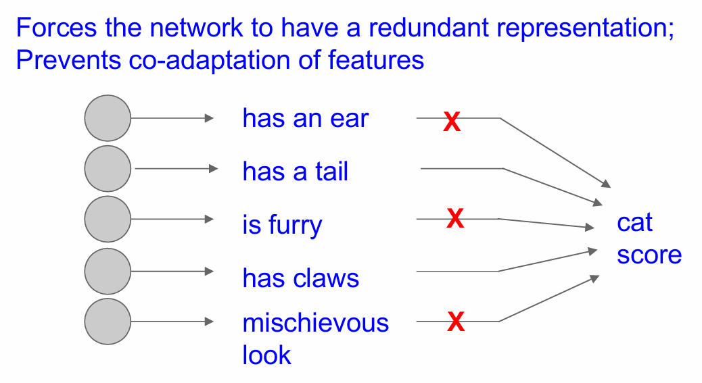

- **防止特征的协同适应**(几个神经元可能会“串通”起来，形成一个高度依赖的小团体来识别某个特征)
- **强制网络学习冗余的表示**(迫使模型学会多种特征)
- **集成学习（with mask）**它不是真的去独立训练成千上万个模型，而是通过权重共享，在一次训练中隐式地、近似地训练了一个庞大的模型集成

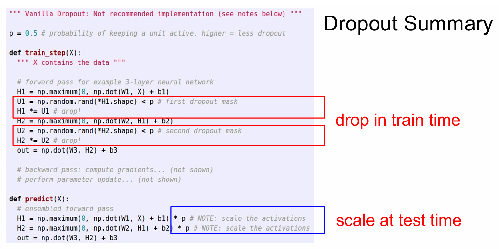

​	**scale at test time**：保证输入幅度一致(eg: P = 0.5)

- ### **Activation Functions**

  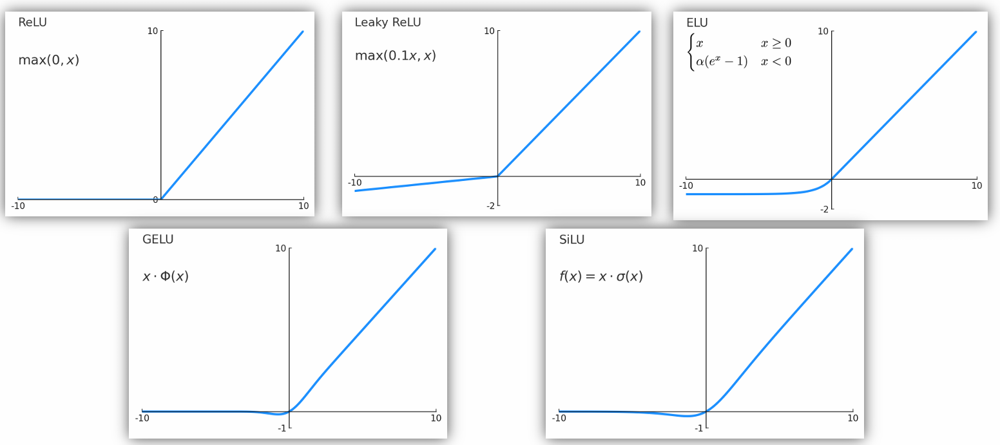

  每一层的梯度都是通过将其与后面所有层的梯度相乘来计算的

  ReLU在很大程度上解决了这个问题。对于所有正数输入，ReLU函数的导数（或梯度）是一个常数**1**。梯度在反向传播时只用乘1，不会缩水

- ### **CNN Architecture**

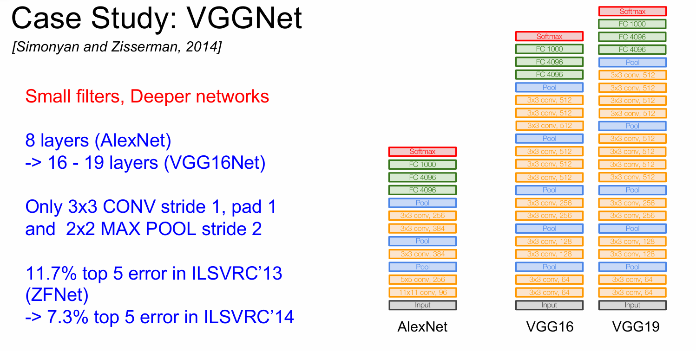

 -  **Q: Why use smaller filters? (3x3 conv)**

   感受野和7*7相同，但是参数减少

   增加非线性

	- **感受野（Receptive Field）**：输入图像中影响当前激活值的部分/某个值在计算前看到的区域

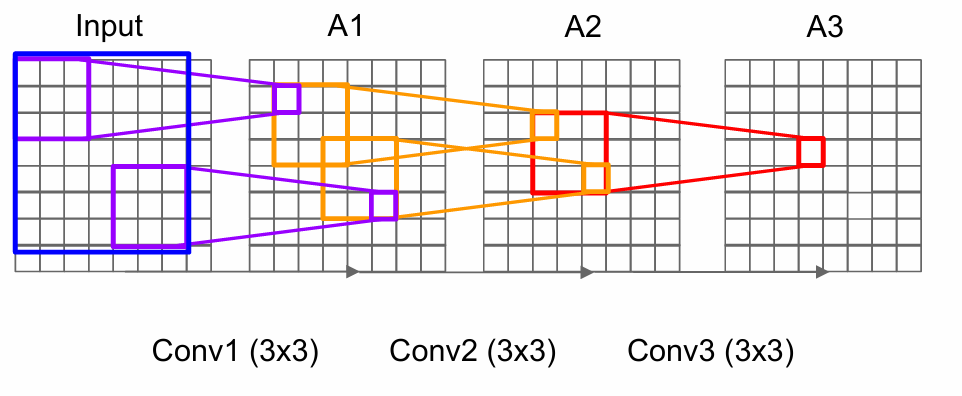


- **ResNet 的解决方案就是改变了学习的目标：与其让网络层费力地学习一个完整的函数，不如让它们只学习与输入相比需要调整的“增量”或“差值”，这使得网络的优化过程变得更加容易，从而可以构建出前所未有的深度。(NLP语义增量角度理解）**

- 你的目标不再是凭空创造，而是**找不同、做微调**。你只需要把你要修改的地方告诉我，比如“左边嘴角需要稍微上扬一点”、“背景颜色要加深一点”。你的最终成品，就是“**原来的画 + 你做的修改**”，也就是 x+F(x)。
- 一步一步加特征（可解释性强）&一次画出来


###  Initialize weights in neural  network layers 


- 初始参数过大，ReLU相当于没有限制

###  Data ==Preprocessing==


- **用image net的**

### Data augmentation


### ❓

**测试时：不再采样随机 z，而是“把这份随机性平均掉”——理想上要计算期望**

- **Horizontal Flips**

- **Random crops and scales**
- **Color Jitter**
- **Cutout**

- **记得可视化**

### Transfer Learning （应用层面）

-  don’t have a lot of data
- 
- 
- 

### Hyperparameter Selection

- **对于两个超参数**


**采样分布选择示例**

| 超参              | 范围                | 采样建议        | 注释                             |
| ----------------- | ------------------- | --------------- | -------------------------------- |
| 学习率 lr         | [1e-5, 1e-1]        | log-uniform     | `10**Uniform[-5,-1]`             |
| weight_decay      | [1e-6, 1e-2]        | log-uniform     | 与 lr 交互强                     |
| dropout           | [0.1, 0.6]          | uniform 或 Beta | 若多数经验集中在 0.1~0.3，可缩窄 |
| hidden_dim (离散) | {128,256,384,512}   | 从集合随机      | 可偏向较小值节省预算             |
| 激活函数          | {relu, gelu, swish} | 从集合随机      | 少量枚举即可                     |


### Training Pipeline

-  Use the architecture from the previous step, use all training  data, turn on small weight decay, find a learning rate that  makes the loss drop significantly within ~100 iterations 
- Good learning rates to try: 1e-1, 1e-2, 1e-3, 1e-4, 1e-5
- ⭐ **Step 1: Check initial loss** 
- **⭐Step 2: Overfit a small sample** 
- **⭐Step 3: Find LR that makes loss go down**
- **⭐Step 4: Coarse grid of hyperparams, train for ~1-5 epochs** 
  - 粗网格（Coarse grid）搜索 + 短周期训练（1-5 个 epochs）
- **⭐Step 5: Refine grid, train longer** 
- **⭐Step 6: Look at loss and accuracy curves (next slides)**
- ⭐**Step 7: GOTO step 5**


# **Lecture 8: Attention and Transformers**

### Transformers

- **Attention可以解决大部分问题,缺点在于计算成本过高**
  - **并行化解决**
- **N^2复杂度有 trade-off 吗？**
  -  **trade-off** = “交换 / 权衡
  - 鱼和熊掌不可兼得
  - 某种程度来说，这是一种优点，因为他计算了更多,推理了更多
- **自注意力机制让不同向量之间相互交流，而MLP或者FFN让我们对每个向量进行独立运算**
- **LayerNorm 是在特征维度上归一化**


### why dk


$$
Q, K \sim \mathcal{N}(0, 1)
$$

$$
Q \cdot K = \sum_{i=1}^{d_k} Q_i K_i
$$

$$
\mathbb{E}[Q_i K_i] = 0
$$

$$
\text{Var}(Q_i K_i) = \mathbb{E}[Q_i^2]\mathbb{E}[K_i^2] = 1 \times 1 = 1
$$

$$
\text{Var}(Q \cdot K) = d_k
$$

$$
Q \cdot K \sim \mathcal{N}(0, d_k)
$$

$$
\frac{Q \cdot K}{\sqrt{d_k}} \sim \mathcal{N}(0, 1)
$$

### why positional encoding


### Encoding and Embedding

- **Embedding** = 给符号一个「坐标」,
  - 指的是把离散的符号（token、单词、节点、ID 等）映射到一个 **连续的向量空间**。
- **Encoding** = 根据上下文/结构把符号「翻译」成特征
  - 本质：特征提取（feature extraction）
  - 常见：RNN encoder, Transformer encoder, CNN feature maps

### Transformer Variation


- **[CLS] token（类令牌）：**Special extra input: classification token (D dims, learned)
- 绿色：内容
- 黄色：可学习的位置编码【模型会逐渐发现，如果把位置1（比如左上角）和位置5（比如中间）的编码向量调整得不那么相似，最终的分类准确率会更高。通过成千上万次的迭代训练，模型会自动地为每个位置“雕琢”出一个最适合这个任务的位置编码向量。】


**Tweaking Transformers**

The Transformer architecture has not changed much since 2017.

But a few changes have become common:

- **Pre-Norm**: Move normalization insideresidual

- **RMSNorm**: Different normalization layer 
- **SwiGLU**: Different MLP architecture 
- **Mixture of Exper（MoE）**:Learn E different MLPs, use A <E of them per token. Massively increase params, modest increase to compute cost.


Post-norm（ **Transformer**论文中的）的层归一化在残差连接之外

有点奇怪，这个模型实际上无法学习识别功能（模型很难学会“什么都不做”，即输入=输出，因为这要求Layer Normalization的输入和输出一样，但是这很难）

解决方案：在自我attention和MLP之前，在剩余连接内移动层归一化（如上图）。

训练更稳定。


- **更高维的非线性**


# **Lecture 9: Object Detection, Image Segmentation, Visualizing and Understanding**


## Computer Vision Tasks


- **Instance Segmentation（实例分割）目标：不仅要给每个像素赋予类别标签，还要区分同类的不同实例**
- **Semantic Segmentation (语义分割)：**计算机从最底层的像素出发，通过对海量像素进行分类和组合，最终**实现了对物体的识别和分割**。这恰恰是语义分割这类算法的强大之处。**它通过给每一个像素进行分类，最终实现了对物体的识别:**
  - 模型不会圈出一个“猫”的框。
  - 模型会逐一判断图片中的每一个像素点：“这个像素是属于猫，还是属于草，还是属于天空？”
  - 当它把所有属于“猫”的像素都找出来并标记为同一类（例如图中的黄色区域）后，这些被标记的像素集合就构成了我们人类眼中的“猫”这个物体。

### Semantic Segmentation


- 我们能不能设计一个网络，它从头到尾只用卷积层 (Convolutional Layers)，并且不进行任何下采样（比如池化）【分辨率不变】，直接输出每个像素预测结果？
- 计算量太大


- **Loss Function**

- **Upsampling: ???**


#### Learnable Upsampling

- We can interpret strided convolution as “learnable downsampling”.


#### U-Net


- **增加感受野 (Increases Receptive Field)**

- **丢失空间信息 (Lose Spatial Information)**

  这是降采样的必然代价。当你用一个值（例如最大值）来代表原始图上一整个区域（如2x2的像素块）时，这个区域内各个像素的**精确位置关系就被模糊或丢失了**。

  网络在深层只知道“这片区域里有眼睛的特征”，但已经不清楚睫毛和瞳孔的精确像素坐标了。

- **创建高分辨率映射 (Create High Resolution Mapping)**

  单纯的上采样无法凭空恢复细节

  使用跳跃连接后，上采样层就同时拥有了两类信息：

  1. 来自网络深层的**高级语义指导**（“这里应该是一只狗”）。
  2. 来自跳跃连接的**精细空间细节**（“狗的精确轮廓和纹理是这样的”）。

​	


### Object Detection: Single Object


- 不具有可拓展性，尤其是针对大量物体的时候

### Object Detection: Multiple Objects

- Apply a CNN to many different crops of the image, CNN classifies each crop as object or background

  > eg：Dog? NO Cat? YES Background? NO

- Problem: Need to apply CNN to huge number of locations, scales, and aspect ratios, very computationally expensive!


#### **Region Proposals**


- **"conv5"features**
  - 太浅的层（conv1–conv3）：特征偏向边缘、纹理，语义不足。
  - 太深的层（fc 层）：空间位置信息丢失，无法定位物体。
  - Conv5 层：既保留了一定空间信息，又具有较强的语义特征，比较适合做目标检测。

- **流程**


- 网络并不是盲目地在特征图上寻找物体。相反，在特征图的**每一个位置**（或称为“锚点”），我们预先定义了**K个**不同尺寸（scale）和不同长宽比（aspect ratio）的**锚框（Anchor boxes）**。这些锚框就像一系列大小不一的“标准窗户”，覆盖了可能出现的各种形状的物体。RPN的任务不是从零开始找物体，而是判断这些预设的“窗户”里有没有物体，并对“窗户”进行微调。
- **计算量大：需要训练两个网络，对每幅图像至少要看两次**

#### Single-Stage Object Detectors: YOLO / SSD / RetinaNet


For each box output:

- **P（object）:probability that the box ==contains== an object** 

- **B bounding boxes （x, y, h, w）**

- **P（class）: probability of ==belonging== to a class（条件概率）**
- **➡️每个网格都会生成相应的框框**
- **➡️Abundant Bounding Box**
- **➡️Many bounding boxes with different object probabilities**
- **➡️Threshold & NMS（non-moximum suppression）**
- **➡️Answer**

**对比：**

- **Faster R-CNN**: **两阶段 (Propose-then-Classify)**。先由RPN生成高质量的候选区域（Region Proposals），然后再由后续的网络对这些区域进行分类和边界框回归。流程更复杂。

- **YOLO**: **单阶段 (Unified Regression)**。没有独立的区域提议步骤。直接在整张图上进行一次性的预测，同时输出**所有物体的类别和位置**。流程非常简洁。

#### Object Detection with Transformers: DETR

Simple object detection pipeline: directly output a set of boxes from a Transformer No anchors, no regression of box transforms Match predicted boxes to GT boxes with bipartite matching; train to regress box coordinates


- **第一个端到端（End-to-End）**
- **直接向图片“提问”N次“物体在哪里？”，然后一次性输出 N 个预测结果（包括类别和位置），无需任何后处理。**
- **顺序不重要，模型可以理解慢慢的找完剩下的框框**

#### Object Detection：Faster R-CNN


**Fast R-CNN的缺点也正在于此**：

- **慢**: Selective Search在CPU上运行，非常耗时，是整个检测流程的性能瓶颈。
- **无法学习**: 它是一套固定的规则，无法根据你的检测任务（比如只检测人脸）进行优化。它只会傻傻地把所有它认为像物体的区域都提出来。

**Faster R-CNN 的“区域提议”**

Faster R-CNN的革命性创新：**区域提议网络 (Region Proposal Network, RPN)**。

- **这是一个“可学习的”提议网络**：RPN本身是一个小型神经网络，它和主干检测网络一起进行训练。这意味着，RPN会**学会**如何为你关心的物体（比如人、车）提出高质量的候选框。它不再是盲目的，而是有目标的。

**流程图：Faster R-CNN**

```
图像` ➡️ `[GPU] 对整图进行一次CNN特征提取` ➡️ `[GPU] RPN网络生成候选区域` ➡️ `[GPU] RoI Pooling` ➡️ `[GPU] 分类与回归`➡️ `最终结果
```

- **优势**: 整个流程统一在深度学习框架内，几乎所有计算都在 GPU 上完成，实现了无缝衔接。


#### **目标检测模型演进总结**

**1. 两阶段检测器 (Two-Stage Detectors) - 精度优先**

这类方法的思路是“**先找后认**”，分为两步走，通常精度更高。

- **R-CNN (开端，但很慢)**
  - **流程**：先用传统算法 **Selective Search** 找出约2000个候选区域，然后**逐一**将这些区域送入CNN网络提取特征并分类。
  - **瓶颈**：对~2000个区域分别计算卷积，速度极慢。
- **Fast R-CNN (重要提速)**
  - **核心改进**：不再对每个区域单独计算，而是对**整张图只进行一次卷积**，得到一个共享的特征图（Feature Map）。然后将候选区域映射到特征图上提取特征。
  - **遗留瓶颈**：区域提议本身（Selective Search）仍然是独立的、在CPU上运行的慢速算法。
- **Faster R-CNN (里程碑)**
  - **核心改进**：引入了**区域提议网络 (Region Proposal Network, RPN)**。
  - **革命性意义**：它用一个可学习的、在GPU上运行的轻量网络（RPN）取代了Selective Search。这使得从“区域提议”到“最终检测”的**全流程都统一在了一个神经网络框架内**，实现了端到端的训练和显著的速度提升。

**2. 单阶段检测器 (Single-Stage Detectors) - 速度优先**

这类方法的思路是“**一步到位**”，将检测视为一个回归问题，速度极快。

- **YOLO (全新范式)**
  - **核心思想**：完全抛弃了“区域提议”阶段。它将图像划分为网格，并让每个网格直接预测其内部的物体类别和边界框。
  - **革命性意义**：将检测流程简化为**单一的网络前向传播**，首次实现了实时（Real-Time）目标检测。

**3. “完全端到端”的探索**

- **YOLO vs. DETR**
  - 虽然YOLO实现了端到端**训练**，但它仍需要一个手工设计的**非极大值抑制（NMS）**后处理步骤来筛掉重复的检测框。
  - 后来的**DETR**模型通过引入Transformer架构，首次**移除了NMS**这个需要手动调整的组件，实现了从输入到最终输出的全流程自动化，代表了对“完全端到端”的更进一步探索。


### Instance Segmentation


- **Mask R-CNN: Very Good Results!**

- **Also does pose（人体关键点检测 / 姿态估计）**


## Visualization & Understanding

#### 卷积核可视化


#### **Saliency Maps（突出可视化）**


**计算显著性 (Saliency via Backprop)**

这是这项技术最关键的部分。我们不再是去调整网络的权重（像训练时那样），而是要计算**最终的类别得分（Class Score）对输入图像的每一个像素的梯度（gradient）**。

- **梯度（Gradient）**：在这里，梯度可以理解为“敏感度”或“影响力”。某个像素的梯度值越大，意味着对这个像素的颜色值做一点点小小的改变，就会对最终“狗”这个类别的得分产生很大的影响。因此，梯度值大的像素就是模型认为“重要”的像素。
- **计算步骤**（如图中下方文字所述）：
  1. **计算梯度**：我们选择“狗”这个类别的得分（通常是未经Softmax函数归一化的原始得分，也叫logit），然后利用**反向传播（Backprop）**算法，计算这个得分相对于输入图像中每一个像素值的梯度。
  2. **取绝对值 (take absolute value)**：梯度有正有负。正梯度意味着增加像素值会增加“狗”的得分，负梯度意味着减小像素值会增加“狗”的得分。但无论正负，只要梯度绝对值大，就说明这个像素很重要。所以我们取其绝对值。
  3. **取RGB通道最大值 (max over RGB channels)**：对于彩色图片，每个像素有红（R）、绿（G）、蓝（B）三个通道，因此每个像素位置会得到三个梯度值。我们取这三个通道中梯度绝对值的最大值，作为这个像素点的最终显著性（saliency）分数。

**结果：显著图 (Saliency Map)**

- 经过以上计算，我们会得到一张新的图像，大小和原图一样。这张图就是**显著图**（如图右下角所示）。
- 在这张图中，**越亮的区域，代表原图中对应位置的像素对模型做出“这是狗”的判断越重要**。
- 从图中的结果可以看出，显著图清晰地勾勒出了小狗的轮廓，而背景区域则几乎是黑色的。这说明，模型确实是“看到”了图片中的小狗，并依据小狗身体区域的像素做出了分类决策，而不是根据背景或其他无关的东西。

#### 激活函数可视化（Class Activation Mapping (CAM)）


- 到底是**根据图像的哪个区域**做出最终决策的
- **Problem: Can only apply to last conv layer**

#### 梯度可视化


- 类Transformer 可视化


# Lecture 10: Video Understanding


#### 视频理解


#### **不同**

- 视频分类——动作

- 视频非常庞大（矩阵）——帧序列——无法直接传输给GPU

  - 解决方案
    1. 让视频更小——时间和空空间上同时压缩

- 如何在长视频上训练模型

   

  - 随机截取一些短小片段
  - 降低帧率（稀疏）

  


#### **相同**

- 【首先】当作图像处理/ 整体看非常相似 / 整体变化不大的
- 【】单帧/ 连续帧 如何选择?
- 如何sanple the frame
  - random(不知道哪里重要)
  - smarter 采样一个 利用这个的位置决定其他位置哪里采样

#### 1. 后期融合 (Late Fusion) - “先独立分析，后集体投票”

- **策略**：先让每个时间点的画面（帧）各自为政，用一个2D CNN分别提取出高级特征，直到最后一刻才把所有时间点的信息汇总。
- **看图表证据**：
  - **Conv2D 和 Pool2D**: 你看，经过两层2D卷积和池化，数据的Size变成了 `24 x 20 x 16 x 16`。注意，**时间维度T始终是20，完全没变！** 这说明，这20帧画面就像20个独立的图片，被20个并行的2D CNN处理，它们之间在此阶段没有任何交流。
  - **感受野 (Receptive Field)**：在前几层，感受野的时间维度 **T 始终是 1**！(`1x3x3`, `1x6x6`...) 这铁证如山地说明，网络中的神经元在前期做决策时，**一次只能看到一帧画面**。它根本不知道上一帧或下一帧发生了什么。
  - **最后一步 (GlobalAvgPool)**：在最后一步，时间维度T从20“Duang”地一下变成了1。这就是所谓的“**All-at-once in time at end**”（在最后时刻一次性融合时间）。
- **评价**：这种方法完全没有利用到视频的动态信息，只是对静态画面的一个简单汇总。


**缺点**

- 全连接层引入大量参数

- 几乎完全忽略了时间顺序和运动信息

#### 2. 早期融合 (Early Fusion) - “先揉成一团，后统一分析”

- **策略**：在网络的最开始，就把所有时间帧的信息“堆叠”或“融合”在一起，然后把它当成一张“超级图片”来处理。
- **看图表证据**：
  - **Input**: `3 x 20 x 64 x 64`。还是20帧，每帧3个颜色通道（RGB）。
  - **第一层 Conv2D (高亮行)**：请看它的Size，变成了 `12 x 64 x 64`。**时间维度T不见了！** 它去哪了？它被合并到了通道C里。这一层的实际操作是把20帧的画面（`20x3`个通道）当成一个有60个通道的单张图片来处理。
  - **比喻一下**：这就像把20页的翻页动画书，不是一页一页看，而是把20页的画面**在空间上对齐，然后压缩成一张超级厚的“照片”**。
  - **感受野 (Receptive Field)**：第一层的感受野时间维度 **T 直接变成了 20** (`20x3x3`)！这说明网络最开始的神经元，一下子就看到了所有20帧的信息。这就是“**All-at-once in time at start**”（在一开始就一次性融合时间）。
- **评价**：虽然它看到了所有帧，但它把时序信息（比如动作的先后顺序）给破坏了，**只是粗暴地将信息叠加**，无法学习到精细的动态变化。


#### 3. 3D CNN - “时空同步，缓慢融合” (Slow Fusion)

- **策略**：这才是最优雅、最符合直觉的方式。它把时间看作和空间（画面的宽高）同等重要的第三个维度，用一个“立方体”卷积核，在时间和空间上同步、渐进地提取信息。
- **看图表证据**：
  - **第一层 Conv3D (高亮行)**：这是一个3D卷积，卷积核是 `3x3x3`。它同时在时间、高度、宽度上进行卷积。
  - **Size**: 你看，时间维度T的变化是**渐进的**。它从20开始，经过几层3D卷积和3D池化，慢慢地变小（这里没显示出来，但实际上会变小）。这和H、W维度的变化方式是一样的。
  - **感受野 (Receptive Field)**：这才是关键！感受野的时间维度T是**逐步增长的**：从 `3` -> `6` -> `14`... 这说明，网络在浅层学习的是**短时间的、简单的运动模式**（比如一个角点在3帧内的移动）；到了深层，这些简单的运动模式被组合起来，形成对**长时间、复杂动作**的理解。
- **评价**：这就是“**Build slowly in space, Build slowly in time**”（在空间上缓慢构建，在时间上也缓慢构建）。这种“**慢融合 (Slow Fusion)**”的策略，**让模型能够学习到从简单到复杂的、层次化的时空特征**，是真正意义上的视频1


#### 三者比较


**（注意看T）**

- **Late Fusion:  Build slowly in space, All-at-once in time at end**

  

- **Early Fusion: Build slowly in space, All-at-once in time at start**

- **3D CNN: Build slowly in space, Build slowly in time ”Slow Fusion”**

  - 空间局部，时间全部（一个卷积核）

- 问题：没有获得时间平移不变性

#### 2D Conv (Early Fusion) vs  3D Conv (3D CNN)

- **2D Conv (Early Fusion)**

  没有获得时间上的平移不变性（如果一个模型学会了在视频的第1-3秒识别出“挥手”这个动作。那么它理应能够用同一个检测机制识别出在视频第10-12秒发生的同一个挥手动作。）

  

-  **3D Conv (3D CNN)**

  具备时间上的平移不变性——识别不同维度上的运动模式

  更高效

#### Dataset

- **Sports-1M**

- **Single Frame  model works well  always try this first!**

#### Architecture

And so on......


#### 总结

- **Late Fusion**：在时间上是个“睁眼瞎”，最后才汇总。
- **Early Fusion**：一开始就把所有时间信息拍扁，失去了动态过程。
- **3D CNN**：像一个真正看电影的人，一帧一帧地看，逐步地在脑海中构建起对动作和剧情的理解。

因此，对于真正需要理解“运动”和“变化”的视频分类任务，**3D CNN 的“慢融合”策略是三者中最强大、最合理的设计**。

___


# **Lecture 15: 3D Vision**

## 三维表示方法

- **Many Ways to Represent Geometry**


- **Explicit——直接告诉你表面在哪里**
  
  > **==直接明确的表示==物体的部分（几何元素，如点、线、面）**
  
  - Point cloud
  - Polygon mesh
  - Subdivision, NURBS
  - …
  
- **Implicit——给你一个规则去判断表面**
  
  > **像一个规则，它定义了一个==函数==或一个约束条件，空间中的任何一个点，都可以通过这个函数来判断它是在物体内部、外部还是恰好在物体表面上。物体表面是所有满足这个“规则”（例如，函数值为零）的点的集合。**
  
  - Lever sets
  - Algebraic surface
  - Distance functions
  - …
  
- Each choice best suited to a different task/type of geometry


### **Point Cloud（点云） **

- **定义 (Definition)**: 点云是一个无序的点集 P={pi}, 其中 pi=(xi,yi,zi)∈R3。
- **核心属性 (Core Property)**: 没有任何点与点之间的**连接性 (Connectivity)**信息。
- **面元 (Surfel)**: 一个带有位置 pi 和法向量 ni 的点, 即 si=(pi,ni)。即**带有方向的点**
  - 作用 eg 研究光照如何与点交互，使得光照渲染更逼真


➡️

- **优点**
  - **表示灵活**：可以轻松表示任意类型的几何体。
  - **适用性广**：对于处理大规模数据集非常有用。
- **局限性**
  - **渲染困难**：在 **欠采样区域 (undersampled regions)**，由于点过于稀疏，很难绘制出清晰的表面。
  - **其他核心限制**:
    - **无法直接简化或细分 (No simplification or subdivision)**：不能像网格一样进行平滑的增减面数操作。
    - **无法平滑渲染 (No direction smooth rendering)**：缺乏表面方向信息，无法实现平滑的光照效果。
    - **无拓扑信息 (No topological information)**：最关键的缺陷。无法知道点之间的连接关系、物体是否有洞等结构信息（正如PPT中圆环的例子所示）。

### **Polygonal Meshes Polygon（多边形网格）**


- **广泛**
- **第一部分：多边形网格及其应用规模 (Polygonal Meshes & Scale)**
  - **核心定义：边界表示法 (Boundary Representation)**
    - 多边形网格是一种通过描述物体**表面**来定义三维形状的方法。它由顶点（Vertices）、边（Edges）和面（Faces）构成，不描述物体的内部。
  - **应用规模的演进**
    - **高精度模型 (A Large Triangle Mesh)**：单个复杂艺术品（如米开朗基罗的《大卫》雕像）的数字模型，其数据量可以达到千万级别（**约5600万个三角形**）。
    - **超大规模场景 (A Very Large Triangle Mesh)**：现代地理信息应用（如Google Earth）通过卫星和航空摄影重建整个城市和地球表面，其数据量可以达到**万亿级别 (Trillions) 的三角形**。
- **第二部分：核心网格处理技术 (Core Mesh Processing Techniques)**
- 
  - **网格上采样 - 细分 (Mesh Upsampling - Subdivision)**
    - **目的**：通过插值增加网格的分辨率。
    - **效果**：将多边形分割成更小的单元，以增加模型的细节并使其表面更平滑。
  - **网格下采样 - 简化 (Mesh Downsampling - Simplification)**
    - **目的**：在尽可能保持原有形状外观的前提下，降低网格分辨率。
    - **效果**：减少模型的多边形数量，常用于性能优化或创建不同层次的细节（LODs）。
  - **网格正则化 (Mesh Regularization)**
    - **目的**：修改采样点（顶点）的分布，以提升网格质量。
    - **效果**：使网格中的多边形形状和大小更均匀、规整，有利于后续的渲染和物理模拟。

### **Parametric Representation**

> 物体并非完全不规则，不仅仅是点和网络的集合，他们非常通用➡️比如说直线


用一个**低维度的参数域（通常是二维）**来表示一个**高维度的几何体（如三维曲面）**


贝塞尔曲面是通过**控制点**来定义的。如幻灯片所示，通过一个控制点网格（那些橙色的点），可以生成一个平滑的曲面“**patch**”。

这个过程背后有一个明确的数学公式，即**贝塞尔曲线的张量积（tensor product）**。它将二维参数域上的每个点 (u,v) 映射到三维空间中的一个点。通过改变控制点的位置，你可以精确地、可预测地改变曲面的形状。因此，它是一种**参数化**的表示。


细分曲面是通过**递归细分**一个粗糙的控制网格来生成平滑曲面的。

这个过程虽然看起来像是在不断增加网格面片，但其原理是基于一套严格的数学规则。每一步细分都是根据邻近顶点的位置，通过一个**加权平均公式**来计算新顶点的位置。这个公式可以被视为一种隐含的参数化表示，它通过一个离散的控制网格来定义一个连续的平滑曲面。因此，它也被归类为**参数化**方法。

**➡️Conclusion：==All points are given directly.==**

- **👍 优点 (Advantage)**

  - **采样非常容易 (Sampling Is Easy)**: 这是显式表示最大的优点之一。因为表面是由一系列明确的多边形（例如三角形）构成的，所以要获取表面上的点（采样）非常简单。你只需遍历这些三角形，就可以轻松生成任意数量的表面点。这对于渲染（光栅化）和将模型转换为点云（方便转换成点集合）等操作极为方便。
- **👎 缺点 (Hard)**

  - **内外判断困难 (Inside/Outside Test Hard)**: 这是一个核心难题。给你空间中的任意一个点P，如何判断它是在一个封闭的网格模型的**内部**还是**外部**？


---

### “Implicit” Representations of Geometry


**隐式表示则是一种间接定义表面的方法。它不直接给出表面的点，而是定义了一个函数，通常是f(x,y,z)，而物体的表面就是所有使得该函数值为零的点(x, y, z)的集合，即f(x, y, z)=0。**

- **👍 优点 (Benefit)**
  - **内外判断非常容易 (Inside/Outside Test Easy)**: 这是隐式表示的“杀手级”优势。要判断一个点(x, y, z)是在物体内部、外部还是表面上，只需将其坐标代入函数f即可
- **👎 缺点 (Hard)**
  - **采样可能很困难 (Sampling can be hard)**: 与显式表示正好相反，要找到隐式表面上的具体点很困难。你不能像遍历列表那样直接得到它们。你需要通过**求解方程**f(x,y,z)=0来找到这些点。这通常需要复杂的数值算法，这些算法的计算成本很高，并且可能找不到所有的解。因此，直接将隐式表面渲染成图像要比渲染显式网格复杂得多。

### **Boolean**


**实体构造几何（CSG）\**是一种\**隐式**的三维建模方法。它不直接存储模型的表面，而是用**隐式方程**
$$
f(x,y,z)≤0
$$
来定义基本的几何体（如球体、圆柱体）。然后，通过**布尔运算**（并集、交集、差集），对这些隐式方程进行逻辑组合，从而精确且紧凑地构建出复杂的形状。

CSG非常强大，因为它能以程序化的方式精确控制模型的形状。但它的缺点是，由布尔运算产生的边界通常是**锐利**的，很难做出平滑的过渡。

### **Distance Functions (Implicit)**


- 它不再使用简单的布尔运算，而是通过**距离函数**来定义和融合表面。

- **符号距离函数 (Signed Distance Function, SDF)**: 距离函数是对于空间中的任意一个点，距离函数会返回这个点到物体表面的**最短距离**。而距离符号函数不仅告诉你距离，还通过**正负号**告诉你这个点是在物体**外部（+）\**还是\**内部（-）**。在物体表面上的点，函数值恰好为0。

- **平滑融合**: 正如图片中两个球体平滑地融合成一个“胶囊”形状所示，通过对两个物体的SDF进行特定的数学运算（而不是简单的布尔运算），可以实现完美的**平滑混合（Blending）**效果。

  

  lerp(A, B) 这个词是 **Linear Interpolation（线性插值）** 的缩写。
  $$
  lerp(A, B, t) = (1 - t) \cdot A + t \cdot B
  $$
  其中：

  - **A**：起点
  - **B**：终点
  - **t**：插值因子，范围通常是 [0, 1]

- 🔹 当

- t = 0 → 结果就是 **A**

- t = 1 → 结果就是 **B**

- t = 0.5 → 结果是 **A 和 B 的中点**

**Scene of Pure Distance Functions(Not Easy!)**

- https://iquilezles.org/articles/raymarchingdf/

- 不会产生“多个距离矛盾”，因为定义里取的是 **最近距离**。


### Level Set Methods （Implicit）


- **Pre-Query/Pre-Compute and Store the value in the matrix**

- **纯数学隐式函数**（如SDF）在处理形状融合、分裂等拓扑变化时非常强大。

- 但是，要用**一个封闭的、精确的数学公式**来描述一个像人脸或复杂雕塑那样的任意形状，几乎是不可能的。

- **“Alternative: store a grid of values approximating function”**（如图）
  - **提出解决方案**: 这就是水平集方法的核心！既然用一个连续的全局公式来定义函数很困难，那么我们就退而求其次：**用一个离散的网格（Grid）来存储这个函数在各个采样点上的近似值**。


上面：在意距离函数，相互的加减

---

下面：只在意物体内部还是外部——二值化

### Voxels


- **体素（Voxel）是像素（Pixel）在三维空间中的自然延伸。**


## 3D如何与Deep Learning结合

### Datasets：AI + Geometry

	


- **重大挑战：对于真实物体，相比2D数据集，3D数据量少的多（受限于时间和人力）**


### Task: AI + Geometry

- **P(S) or P(S∣c) --- Generative models**
  - Learning (conditional) shape priors
  - Shape generation, completion, & geometry data processing
- **P(c∣S) --- Discriminative models**
  - Learning shape descriptors
  - Shape classification, segmentation, view estimation, etc.
- **Joint modeling of 3D and 2D data**
  - Large-scale 2D datasets & very good pretrained models
  - Differentiable projection/back-projection & differentiable/neural rendering
- **Joint modeling of multi-modal data beyond visual (e.g., text)**

👇

**1. 生成模型 (Generative Models): P(S) 或 P(S∣c)**

这代表了机器学习中的一类模型，其目标是**学习数据是如何生成的**。在3D领域，它学习的是“一个有效、真实的三维形状应该是什么样的”。

- **P(S) (无条件生成)**: 模型学习所有形状的总体概率分布。它的任务是凭空**生成（Generate）**一个全新的、看起来合理的三维模型。例如，训练一个关于椅子的$P(S)$模型，它就能生成各种各样你没见过的椅子。
- **P(S∣c) (有条件生成)**: 模型学习在给定某些**条件 c** 的情况下，生成特定形状 S 的概率。这里的条件 c 可以是：
  - **一个类别标签**: c = "扶手椅"，模型就专门生成扶手椅。
  - **一张2D图片**: c = 一张椅子的照片，模型就重建出这张照片对应的3D椅子模型。
  - **一段文本描述**: c = "一个红色的皮质沙发"，模型就生成符合描述的3D模型。
- **应用**:
  - **学习形状先验 (Shape priors)**: 让模型理解某一类物体（比如人脸、汽车）的“通用结构规则”。
  - **形状生成、补全**: 凭空创造新模型，或将一个残缺的3D扫描模型（比如只扫描到正面）自动补全其缺失部分。

**2. 判别模型 (Discriminative Models): P(c∣S)**

这类模型的目标与生成模型相反，它不关心数据如何生成，而是关心如何**对输入的数据进行分类或预测**。它学习的是不同类别数据之间的“决策边界”。

- **P(c∣S)**: 给定一个输入的三维形状 S，模型判断它属于某个类别 c 的概率是多少。
- **核心任务**: **理解和分析（Understand and Analyze）**已有的3D形状。
- **应用**:
  - **学习形状描述符 (Shape descriptors)**: 将一个复杂的3D模型压缩成一个紧凑的特征向量（描述符），这个向量能抓住模型的核心几何特征。
  - **形状分类 (Classification)**: 判断一个3D模型是椅子、桌子还是台灯。
  - **部件分割 (Segmentation)**: 识别出椅子的各个部分，比如椅腿、椅背、坐垫。
  - **视角估计 (View estimation)**: 判断一个物体是从哪个角度观察的。

**一个简单的类比**:

- **生成模型** 像一个**小说家**，他学习了很多故事后，可以自己创作新故事。
- **判别模型** 像一个**文学评论家**，他读一个故事后，可以判断这个故事属于什么流派（科幻、爱情）。

**3. 3D与2D数据的联合建模 (Joint modeling of 3D and 2D data)**

这是一个非常重要的现代研究方向，核心思想是**利用海量的2D数据来帮助理解和生成稀缺的3D数据**。

- **动机**: 我们之前讨论过，高质量的3D数据集非常少，而2D图片数据集（如ImageNet）则数以亿计，并且已经有很多强大的预训练模型（Pretrained models）。
- **关键技术**: **可微分渲染 (Differentiable Rendering)**。这是一种革命性的技术，它构建了一座从3D到2D的“数学桥梁”。
  - 传统渲染器：给一个3D模型 -> 输出一张2D图片。
  - 可微分渲染器：给一个3D模型 -> 输出一张2D图片，**并且**可以计算出2D图片中每个像素的颜色相对于3D模型（如顶点位置、相机参数）的梯度。
  - **作用**: 这意味着，如果渲染出的2D图片与目标图片有差异，我们可以利用这个差异（loss）通过梯度下降来**直接优化3D模型本身**。这使得AI仅通过“看”2D图片就能学习如何创建和修改3D世界，催生了**NeRF (神经辐射场)**等技术的诞生。

**4. 超越视觉的多模态数据联合建模 (Joint modeling of multi-modal data)**

这是该领域的最新前沿，目标是**将3D几何与文本、声音等更多类型的数据关联起来**。

- **核心思想**: 建立一个统一的“语义空间”，在这个空间里，一把椅子的3D模型、一张椅子的照片、以及“椅子”这个词的文本向量，它们在数学上的表示是相近的。
- **典型应用**: **文本到3D生成 (Text-to-3D)**。用户输入一段文字描述（例如“一个牛油果形状的扶手椅”），AI就能自动生成相应的3D模型。这正是OpenAI的DALL-E、Midjourney等文生图模型在3D领域的延伸。

总而言之，这张幻灯片从3D深度学习的基础（生成/判别模型）讲起，逐步深入到利用2D数据辅助3D学习的核心技术（可微分渲染），最终展望了与文本等多模态数据融合的未来方向。


### Multi-View CNN


- **用的2D CNN（因为数据集只有ImageNet好用并且表现很好当时）**
- **之后放弃，因为3D Data增多**
- **不过现在这个趋势又回来了（图像和视频模型变得强大，比如Veo3）**
- **所以可以更多依赖图像和视频技术，因为2D数据集的量比3D数据多很多很多倍（可能百万倍）**


**Multi-View Representations**

**优点**

- Indeed gives good performance
  - 尽管思想简单，但多视图方法在很多三维任务（尤其是形状分类）上的表现非常出色，曾经长时间是该领域的最佳方法（state-of-the-art），直到今天它仍然是一个非常强的基准（strong baseline）。
- Can leverage vast literature of image classification（(可以利用图像分类领域的庞大文献/技术)）
  - 这是它最关键的优势。二维图像分析是计算机视觉中研究最深入、技术最成熟的领域。我们有大量强大且经过优化的网络架构，如**卷积神经网络 (CNNs)**，例如 ResNet, VGG, Vision Transformer 等。多视图方法允许我们**直接将这些强大的2D工具用于3D问题**，而无需从零开始设计全新的、复杂的3D网络结构。
- Can use pretrained features
  - 这是上一点带来的直接好处。在大型2D数据集（如 ImageNet）上预训练的模型已经学会了识别各种有用的视觉特征（如边缘、纹理、轮廓、物体部件等）。通过**迁移学习（Transfer Learning）**，我们可以直接使用这些强大的预训练模型来提取每张视图的特征，这极大地节省了训练时间，提高了模型的性能和泛化能力，尤其是在3D数据集规模较小的情况下。

**缺点**

- Need projection（需要投影/渲染）

  - 这个方法有一个必要的前提：你需要一个**渲染引擎**（投影器）来将3D模型转换成2D视图。这个过程本身可能比较耗时。更重要的是，它**假设你拥有一个干净、完整、适合渲染的3D模型**（比如 watertight 的三角网格模型）。

- What if the input is noisy and/or incomplete? e.g.,point cloud

  - 这是该方法最主要的软肋。它对干净的CAD模型等数据非常有效。但真实世界通过3D扫描仪或LiDAR获取的数据通常是**点云（point cloud）**的形式，这种数据往往是：
    - **带噪声的 (Noisy)**: 点的位置不完全精确。
    - **不完整的 (Incomplete)**: 由于遮挡，扫描数据会有很多“破洞”。
    - **无结构的 (Unstructured)**: 只是点的集合，没有表面的连接信息。

  - 从这样混乱的数据中很难渲染出清晰、一致的多视图图像。渲染出的图片上会有很多空洞和噪点，这会严重干扰2D图像识别模型的判断。因此，对于原始的、有噪声的点云数据，多视图方法通常不是最佳选择。


### **3D Conv Deep Belief Networks （CDBN）**

- **Pixels -> Voxels**


- **用于生成/分类**


### 3D-GANs & Visual Object Networks (Geometry + Rendering)


- **SLOW 预采样，无效内容（空间等）**

### Octave Tree Representations


### Eulerian -> Lagrangian


### PointNet: First Learning on Point Tool for Clouds


- #### **Invariances（不变性）**

The model has to respect key desiderata for point clouds:

- **Point Permutation Invariance**

Point cloud is a set of ==unordered== points


$$
f(x_1, x_2, \ldots, x_n) \equiv f(x_{\pi_1}, x_{\pi_2}, \ldots, x_{\pi_n}), \quad x_i \in \mathbb{R}^D
$$

Examples:

$$
f(x_1, x_2, \ldots, x_n) = \max\{x_1, x_2, \ldots, x_n\}
$$

$$
f(x_1, x_2, \ldots, x_n) = x_1 + x_2 + \ldots + x_n
$$


➡️Graph NNs on Point Clouds

- Points -> Nodes

- Neighborhood -> Edges

- Graph NNs for point cloud processing

- **Sampling Invariance**

Output a function of the underlying geometry and ==not the sampling==


- Loss Function


### AtlasNet


- **AtlasNet** 的创新之处在于，它将生成问题转化为一个**参数化**问题。它认为，任何平滑的三维曲面都可以通过一个函数，将一个低维的参数空间（如二维平面）映射到三维空间来生成。
- 这种方法生成的形状具有天生的**平滑性**和**连续性**，因为它直接在潜在参数域上进行操作，而不是在离散的网格或点云上。这使得生成的模型质量更高。
- 使用多个MLP：类比将一张纸折叠N次

- **Result**	
  - Voxel：受限于分辨率
  - Point Cloud：无法获得平滑表面
  - AtlasNet：平滑✅，学习多个低维到高维的映射


**在做什么？ MAP  Input Space太大$(O(N^3))$，Output Space太小 function太复杂 很难最佳的映射**


---


### Deep Implicit Functions（**深度隐式函数** ）

2019年CVPR大会上出现的几篇标志性论文，如 **DeepSDF** 和 **Occupancy Networks**，完美地解决了上述问题。它们的核心思想是：

**不再存储几何体本身，而是用一个神经网络来近似一个“场函数” (Field Function)，你去查询空间中任意一个点 p=(x,y,z) ，这个函数可以告诉你该点的==属性(Property)==。**

这个属性通常是：

- **符号距离函数 (Signed Distance Function, SDF)**：点 (x,y,z) 到物体表面的最近距离，如果在物体内部则为负，外部为正，表面为0。
- **占用率 (Occupancy)**：点 (x,y,z) 在物体内部的概率（0到1之间）
- ......


- **Final：现在仍然被沿用**
- **内外二分类**
- **距离函数（该点到物体表面的距离/颜色/不透明度）**
- **原理：分类——查询三维空间中的某些点➡️得到某种属性➡️和深度学习融合**  

### NeRF**(Neural Radiance Fields, 神经辐射场)**

- NeRF 的目标是：**仅通过一组静态的、从不同视角拍摄的二维图片，就能合成出这个场景在任意新视角的、非常逼真的三维视图。而且可以直接用2D图像来训练**。


标有 **g.t.** (Ground Truth 的缩写) 的颜色条，是输入训练集的 **真实照片** 上对应像素的 **真实颜色**。

**输入 (Input)**: 一个5D向量 `(x, y, z, θ, φ)`。

- ##### `(x, y, z)`: 空间中一个点的三维坐标。
- `(θ, φ)`: 一个二维的观察方向。

**输出 (Output)**: 一个4D向量 `(R, G, B, σ)`。

- `(R, G, B)`: 在 `(x, y, z)` 这个点上，从 `(θ, φ)` 方向观察到的**颜色**。观察方向很重要，因为它可以模拟出反光、高光等视角相关的效果。
- `σ` (sigma): **体密度 (Volume Density)**。你可以把它理解为在 `(x, y, z)` 这个点上“物质”的浓度或不透明度。`σ`越高，说明这个点越不透明，越有可能属于某个物体的表面。


- **核心：**
  - **不是只关注几何，而是同时处理几何和外观**
  - **从二维图像而非三维形状进行学习**

- **c (最终颜色)**: 这是我们最终计算出的、显示在屏幕上的那个像素的颜色（一个 RGB 向量）。
- **≈ (约等于)**: 这里用约等于是因为这个公式是一个离散近似。在物理世界中，光线穿过体积是连续的过程，应该用积分来计算。但在计算机中，我们通过在光线上取 n 个离散的采样点来模拟这个过程，所以是近似。
- **∑i=1n (求和)**: 这个符号表示我们将光线上所有 n 个采样点的颜色贡献 **全部累加起来**，得到最终的像素颜色。
- **Ti (透射率/Transmittance)**: 这是最关键也最巧妙的部分。它代表了 **有多少比例的光能够毫发无损地穿过前面的 i−1 个点，最终“抵达”第 i 个点**。如果前面的点非常不透明，那么能到达点 i 的光就很少，Ti 的值就会很低。
  - `T_i` 就是把从第1个到第 `i-1` 个片段的**所有透明度全部乘起来**。这很符合物理直觉：光线要想到达第 `i` 段，必须成功穿过前面所有的路障。

- **αi (不透明度/Alpha值)**: 这是第 i 个采样点的 **不透明度**。它代表了这个点上的“物质”有多浓。
  - 如果 αi=1，说明这个点完全不透明，光线到这里就“停”了。
  - 如果 αi=0，说明这个点完全透明（比如是真空），对光线没有影响。
  - 在 NeRF 中，αi 是根据神经网络预测的体密度 σi 计算出来的：αi=1−exp(−σiδi)。
- **ci (采样点颜色)**: 这是光线上第 i 个采样点 **自身的颜色**。在 NeRF 的场景里，这个颜色是由神经网络 Fθ 预测出来的。你可以把它想象成是那个点上小尘埃的颜色。

$$
\mathbf{c}\approx\sum_{i=1}^n(\text{光线到达点i的能量})\times(\text{点i贡献的颜色})
$$

$$
\mathbf{c}\approx\sum_{i=1}^nT_i\times(\alpha_i\mathbf{c}_i)
$$

**为什么说它是“Trivially Differentiable” (简单可微的)？** 因为这个公式以及计算 Ti 和 αi 的所有步骤，只涉及到 **加法、乘法和指数函数**。这些都是非常基础、求导简单的数学运算。整个渲染流程中没有任何复杂的、不可导的判断（比如 `if/else`），所以我们可以轻易地计算出最终颜色 c 相对于每一个输入的 ci 和 αi 的梯度，从而让神经网络能够学习。


- **Problem：推理的时候，必须持续采样点➡️SLOW**

**NeRF parameterizes scenes densely, at every point in space.A lot of points are wasted, just like in voxel.**


###  Gaussian splatting

NeRF 将整个三维空间看作一个连续的、密不透风的场（像一块果冻），需要用一个庞大的神经网络去描述每一个点的属性。

而高斯泼溅认为：**一个场景大部分是空的，我们只需要描述有物质的地方就行了**。

它采用的方法是，用成千上万个微小的、半透明的 **“3D高斯球” (3D Gaussian blobs)** 来“拼凑”出整个场景。

我们可以通过图中的元素来理解这些“高斯球”的属性：

- **位置 (Position)**：每个高斯球在三维空间中都有一个中心点。
- **形状 (Shape/Covariance)**：它们不一定是完美的球体。可以是椭球，可以被任意地拉伸、旋转和缩放。图中的红色椭球体就展示了这一点。
- **颜色 (Color)**：每个高斯球都带有自身的颜色 (RGB)。如图中的红色和绿色。
- **不透明度 (Opacity/Alpha)**：每个高斯球都有一个不透明度 σ。σ=1 表示完全不透明，σ=0.5 表示半透明。 


- **NeRF (稠密表示)**: 使用一个神经网络来定义**空间中每一个点**的属性。即使是空无一物的区域，NeRF函数也能被查询，只是会返回一个接近于0的密度。这是一种**稠密 (dense)** 的表示方法。
- **Gaussian Splatting (稀疏表示)**: 它不定义整个空间，而是反其道而行之。它认为场景是由大量离散的、有“实体”的部分构成的。因此，它只在**有物体的地方**放置和描述模型，对于完全空白的区域（如图中 `σ=0` 的星星所示）则完全不进行建模。这是一种**稀疏 (sparse)** 的表示方法，也是它高效的关键。


**Results**


**`Instant-NGP` (浅蓝色)**: 一种非常著名的 **快速NeRF** 变体。它的核心优势是训练速度快，但通常会牺牲一些图像质量。

**`MipNeRF360` (深绿色)**: 一种 **高质量NeRF** 的代表。它在处理复杂场景和抗混叠方面做得非常好，通常被用作衡量渲染质量的黄金标准 (Gold Standard)，但它的巨大缺点是训练和渲染都极其缓慢。

**`Ours(7K)` 和 `Ours(30K)` (红色和橙色)**: 这里的 "Ours" 指的就是这门课或论文的作者提出的方法，也就是 **3D高斯泼溅 (3D Gaussian Splatting)**。7K 和 30K 可能代表初始化的点云数量，可以理解为两种不同配置下的高斯泼溅模型。

**左：质量 (Quality)**

这两个指标衡量了生成图像的逼真程度，**数值越高越好**。

1. **SSIM (结构相似性)**:
   - `MipNeRF360` 质量很高，在 0.80 左右。
   - `Instant-NGP` 质量稍低，为 0.72。
   - **`Ours` (高斯泼溅)** 的质量非常高，达到了 0.78 和 0.83，与高质量的 `MipNeRF360` 相当甚至超越。
2. **PSNR (峰值信噪比)**:
   - `MipNeRF360` 依然是质量标杆，达到了 27.11。
   - `Instant-NGP` 相对较低，为 24.92。
   - **`Ours` (高斯泼溅)** 同样表现优异，达到了 25.2 和 26.91，极其接近 `MipNeRF360`。

**质量结论**: 在渲染质量上，高斯泼溅方法完全可以与顶级的、以质量著称但速度缓慢的 NeRF 模型相媲美。


### 3D物体的几何规律性

对称性、重复性...

1. **Segmented Geometry (分段/分割几何)**

将一个复杂的几何体分割成若干个语义上有意义的部分。

* 核心理念：一个物体 = {部件1, 部件2, 部件3, ...}

Pros (优点)

* **Simple to construct (易于构建)**
    对于人类设计师或计算机程序来说，分别创建一些简单的部件（如方块、圆柱、简单的曲面），然后再将它们组合起来，通常比一次性从头开始创建一个非常复杂的整体模型要容易得多。

* **Re-use models for unstructured geometry (可重用非结构化几何模型)**
    对于每一个独立的部件（比如一条椅子腿），我们可以用任何标准的、通用的几何表示方法来描述它，比如 Mesh (三角网格)、Point Cloud (点云) 或 Voxel (体素)。我们不需要为这种组合式的结构发明一套全新的底层几何表示，只需要在上层管理这些部件的列表和它们之间的关系即可。

Cons (缺点)

* **Integrity of atomic elements not guaranteed by construction (原子元素的完整性无法通过构造得到保证)**
    这是一个非常关键的限制，尤其是在使用 Generative Model (生成模型)（例如AI绘画、AI建模）来创造新物体时。模型可能会生成一些“四不像”的部件，比如一个既不是椅子腿也不是椅子面的扭曲几何体。每个部件的形状合理性都需要模型自己来保证。

* **generative model must learn to output coherent segments (生成模型必须学会输出连贯的片段)**
    与上一点相关，AI模型在生成时，不仅要保证每个部件自身的形状是合理的，还必须确保这些部件组合在一起是符合逻辑的。例如，模型生成的四个椅子腿可能长短不一，或者椅子面和椅子腿之间有巨大的穿模或缝隙。

---

2. **Part Sets (部件集)**

将物体看作是从一个预先定义好的、有效的“零件库”中挑选零件组装而成。可以想象成用乐高积木拼模型。

* 核心理念：一个物体 = 从零件库 {L1, L2, L3, ...} 中挑选出的 {L1, L2, L5} 的集合。

Pros (优点)

* **Part integrity guaranteed (部件完整性得到保证)**
    由于所有的部件都来自于一个预先定义好的零件库，所以每个部件本身的形状一定是有效的、完整的，从根本上避免了“分段几何”中可能生成无效部件的问题。

Cons (缺点)

* **No relationships between parts (e.g. nothing to prevent parts from 'floating') (部件之间没有关系；例如，无法阻止部件“悬浮”)**
    这种表示方法只关心“用了哪些零件”，而不关心“这些零件是如何连接的”。因此，模型可能会生成一个椅子面和四条腿都存在，但四条腿都悬浮在空中，并没有与椅子面正确连接的模型。

---

3. **Relationship Graphs (关系图)**

在“部件集”的基础上，增加了部件之间的连接关系，形成一个图结构。部件是图的节点 (Node)，关系是图的边 (Edge)。

* 核心理念：一个物体 = ({部件1, 部件2}, {关系(1,2)})

Pros (优点)

* **Can enforce important relationships (e.g. 'connectivity') (可以强制执行重要的关系，例如“连接性”)**
    通过在图中明确定义边（关系），可以强制要求某些部件必须相互连接，从而解决了“部件集”中零件悬浮的问题。例如，我们可以定义“椅子腿”必须与“椅子面”的“底部”相连。

Cons (缺点)

* **In general, machine learning models for graph generation still an open problem (总的来说，用于图生成的机器学习模型仍然是一个悬而未决的问题)**
    虽然图结构表达能力强，但让机器学习模型（尤其是生成模型）从零开始学习如何创建和处理复杂的、通用的图结构，在技术上仍然是一个非常前沿且充满挑战的研究领域。

---

4. **Hierarchies (层次结构 / 树状结构)**

用树状结构来组织物体的部件，体现了部件之间的层级和从属关系。

* 核心理念：椅子 -> {基座, 靠背}；基座 -> {腿1, 腿2, 腿3, 腿4}

Pros (优点)

* **Tree generative models better understood than graph generative models (树生成模型比图生成模型更容易理解和实现)**
    相比于通用的图结构，树结构更简单、约束更强。因此，学术界对于如何生成树状数据的机器学习模型有更深入的研究和更成熟的方法。

Cons (缺点)

* **Not all structures of interest can be (naturally) expressed as trees (并非所有感兴趣的结构都能被（自然地）表示为树)**
    树结构无法表示“环路”。例如，一个自行车的车架，其各个横梁之间构成了闭环，这种非层级的连接关系无法用简单的树来自然地表达。

---

5. **Hierarchical Graphs (层次图)**

结合了“层次结构”和“关系图”的优点，既能表达部件间的层级关系，也能表达同层级部件间的连接关系。

* 核心理念：在树的每个层级内部，节点之间可以形成一个图。

Pros (优点)

* **Models both naturally hierarchical structure as well as naturally lateral relationships (既能模拟自然的层次结构，也能模拟自然的横向关系)**
* **Graphs per level are simpler -> easier to generate than large, general-purpose graphs (每层的图更简单，从而比生成大型通用图更容易)**

Cons (缺点)

* **Difficult to obtain / expensive to annotate data in this format (难以获取/标注这种格式的数据)**
    要创建一个包含层次图结构的大型3D模型数据集，需要进行大量复杂且昂贵的人工标注工作。

---

6. **Programs (程序化生成)**

使用一段代码或一个程序来表示3D模型。这个程序执行后会生成最终的几何体。

* 核心理念：`create_chair(num_legs=4, back_height=0.5)`

Pros (优点)

* **Subsumes all other representations (programs can generate any of them) (包含所有其他表示形式（程序可以生成它们中的任何一个）)**
    程序具有图灵完备的表达能力，理论上可以生成任何由其他方法表示的几何体，是表达能力最强的一种方式。
* **Express natural degrees of freedom via free parameters (通过自由参数表达自然的自由度)**
    可以非常直观地通过调整程序的参数来控制生成模型的变化。例如，通过改变 `num_legs` 参数就能生成三条腿或五条腿的凳子，而无需重新建模。

Cons (缺点)

* **Even more difficult to get data in this format (更难获取这种格式的数据)**
    让大量的3D模型都反向工程成一段简洁、规范、可学习的程序，是极其困难的。目前几乎没有这样的大型数据集。

### **Representing** **Element** **Structure**

- Segmented Geometry 
- Part Sets

- Relationship Graphs 
- Hierarchies

- Hierarchical Graphs 
- Programs


**趋势：大语言模型对约束的理解去生成3D图形**


## **Lecture 16: Vision and Language** 

**we build Foundation Models**

Pre-train one model that acts as the foundation for many different tasks


### SimCLR


Self-supervised

The main idea was to learning concepts without labels -> a self-supervised pretraining objective

The hope was that the learned representations generalize to new instances

Can we generalize these representations beyond just images? To language perhaps?


### CLIP


**选定一张图片 (ui)**。

他看向所有的 n 个文本（v1,...,vn）。

他需要计算和**每个人*文本的“亲密度”（相似度 ⟨u,v⟩）。

- ⟨ui,vi⟩ 是和**正确文本**的亲密度。
- ⟨ui,vj⟩ (当 j\\=i) 是和**所有其他文本**的亲密度。


泛化能力强➡️text增强了其表示能力/互联网海量图像-文字pair

### CoCa


**CoCa = CLIP 的对比学习 + 自回归描述生成**，用生成目标加强了图文对齐与理解

仅有对比学习时，模型更擅长**全局匹配**；加上生成式监督，可以学到**局部、可组合的视觉—语言对齐**（例如动作、关系词）。

两种目标**互补**：对比学习提高开放词表对齐与检索稳定性，captioning 提升细节理解与可控输出；联合训练通常让零样本、检索和描述都更强。

**Advantages of CLIP-style models**

1. Dot product is super efficient
   1. Easy to train (enables scaling)
   2. Fast inference, e.g., retrieval over 5B images


2. Open-vocabulary (zero-shot generalization)

3. Can be chained with other models (CuPL) [we will discuss this later today]

**Disadvantages of CLIP-style models**

1. Rely too heavily on batch size to learn concepts（负样本不够多）
1. Image-level captions are insufficient supervision（很多被当作负例的配对其实也“说得通”）
1. You can’t know everything in your 5B dataset（仍然不够）


### LLaVA

**Can we build a model that can accept images and text as input, and then output text?**

➡️Vision-Language Models

LLaVA uses the autoregressive nature of LLMs


CLIP 经过大规模图文对比学习，视觉向量里已经编码了“猫、狗、颜色、场景”等**高层语义**，而且和文本空间大致**同构**（相似结构）

### Flamingo

Flamingo followed up with a new way to fuse（融合） visual features

Flamingo将LM基本冻结**，只在若干层之间**插入一小块可训练的“水龙头”**（Gated XATTN‑DENSE）。需要视觉信息时再拧开，不需要时保持原样。这样**稳定、参数少、效果好**。


**Perceiver Resampler (感知器重采样器)** ：Vision Encoder输出的视觉特征可能非常多，这个模块像一个“压缩器”，它把大量的视觉特征下采样成少数几个固定大小的视觉token。

**LM（文本思考），XATTN（看图）交替进行**


### Molmo

Data matters! Quality over quantity even for pretraining


- Internet data is incidental 
- Human annotated data is intentional


把那些非常尝试/显而易见的东西描述出来

dense captions！！！！


模型架构大致相同，数据集质量很高

### SAM


Problem: Ambiguity in correct prompt


**Generate Data**


**Result**


Zero-shot 也很棒！

### CuPL

**CUstomized Prompts via Language models**

利用GPT描述事物(clip没见过的)的能力

Chain：将不同模型串联起来

### VisProg 

**visual programming**


➡️conclusion：两种方式

1. 静态：provide more examples, hopes it could generalizes
2. 动态：given this question which is the best way （like agent）

➡️combine： 能否将这些能力浓缩到一个模型中

- ❓：当能力需求超出现有工具范围时，这些模型能否在需要新工具时自行构建
  - 可以，但是处于早期阶段


